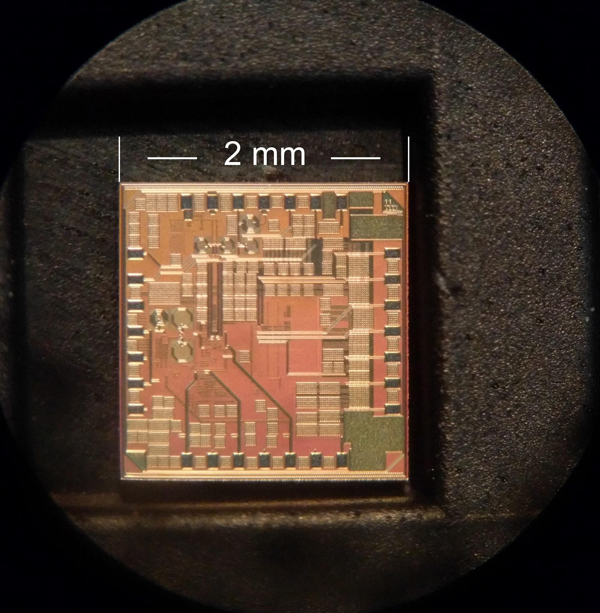
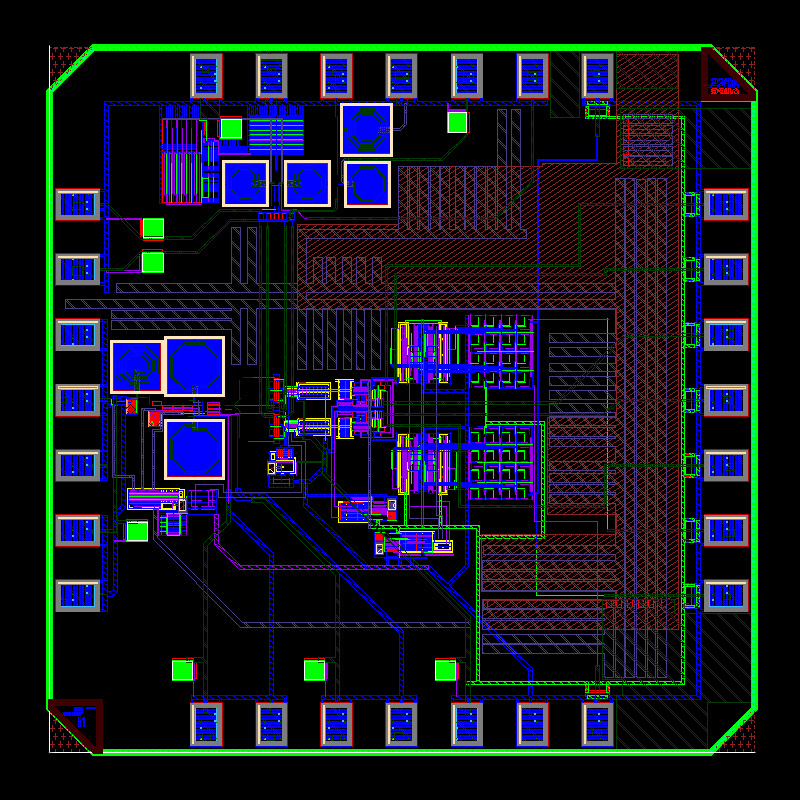

  

    

      
A complete 24-GHz radar transceiver on a single 2 × 2 mm chip, built in GlobalFoundries' 0.13-µm <strong>CMOS</strong> process. K-band radar front ends were traditionally made in GaAs. Moving them to standard CMOS lowers the cost, which matters most for radar in consumer electronics and biomedical devices.

      
I worked on this chip with <strong>yearONE LLC</strong>, a startup, and was responsible for the transmitter. To keep the cost down, the die goes into a low-cost QFN (quad flat no-lead) package.

      
Industry collaborationyearONE LLC2013–2014

    

    <dl class="rp-facts">
      
<dt>Frequency</dt><dd>24 GHz (K-band)</dd>

      
<dt>Process</dt><dd>GlobalFoundries 0.13-µm CMOS</dd>

      
<dt>Die size</dt><dd>2 × 2 mm</dd>

      
<dt>Package</dt><dd>QFN</dd>

      
<dt>Design tools</dt><dd>Cadence Virtuoso</dd>

    </dl>
  

  <figure class="rp-monitor">
    
    <figcaption><b>Fig. 1</b>The fabricated 2 × 2 mm radar transceiver die</figcaption>
  </figure>
  <section>
    <h2>My Part: the Transmitter</h2>
    
From oscillator to package pin

    

      
<small>01 · Source</small><strong>LC-tank VCO</strong>Generates the 24-GHz carrier, tuned by an inductor-capacitor resonator.

      
<small>02 · Phases</small><strong>Polyphase filter</strong>Splits the signal into quadrature phases.

      
<small>03 · Drive</small><strong>RF buffers</strong>Buffer the signal between stages and drive the output.

      
<small>04 · Output</small><strong>Package matching network</strong>Matches the transmitter output to the QFN package.

    

  </section>
  <section>
    <h2>Layout and Fabrication</h2>
    
Cadence Virtuoso to silicon

    

      
The chip was designed in Cadence Virtuoso. Fig. 2 shows the final layout of the full transceiver, and Fig. 1 the fabricated die.

    

    <figure class="rp-fig rp-narrow"><figcaption><b>Fig. 2</b>Layout of the 24-GHz radar transceiver</figcaption></figure>
  </section>
  

    Collaboration with yearONE LLC
    <a href="/research-projects/">All research projects</a> · <a href="/publications/">Publications</a>
  

