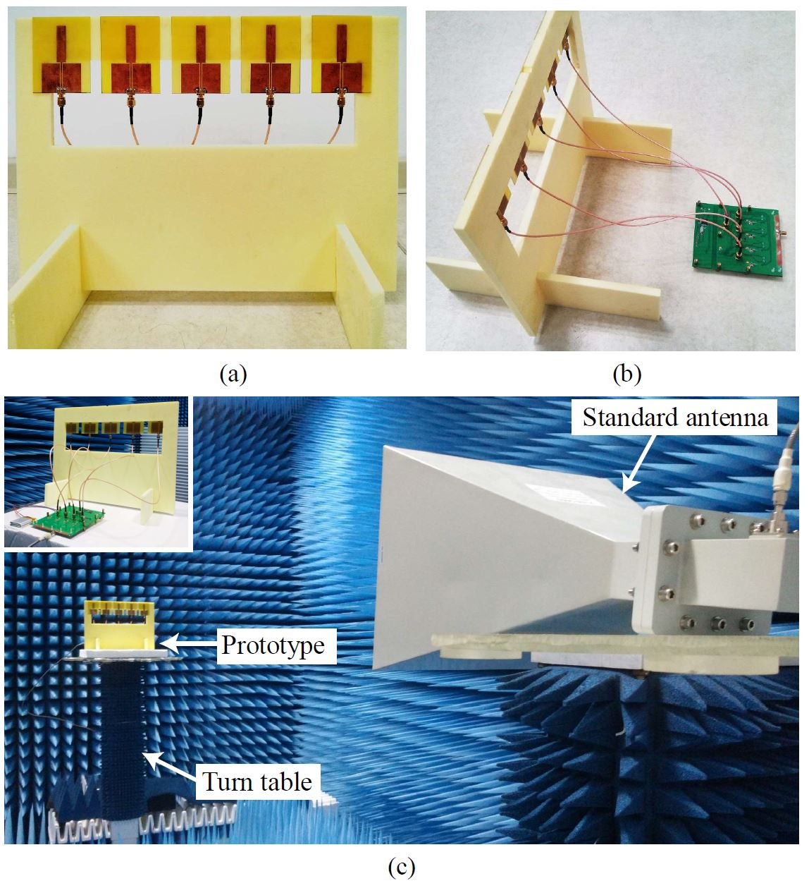
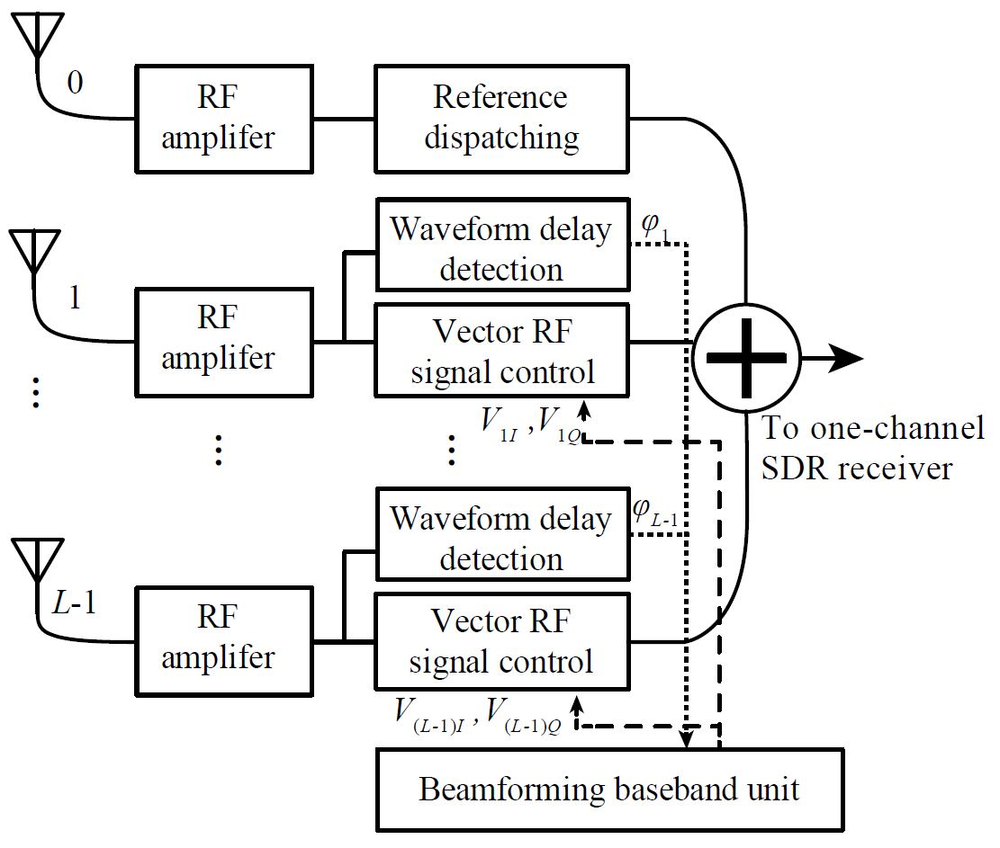

  

    

      
Wideband digital beamforming usually needs a T/R module and fast baseband hardware on every antenna channel, which makes it expensive and power-hungry. This project proposes a <strong>“complex domain” RF front end</strong> that does the beamforming in the RF domain instead.

      
The information that adaptive beamforming actually needs, the waveform delay between antenna elements, changes slowly compared with the RF signal itself. The front end extracts that delay information from the wideband signals, so a <strong>low-speed baseband</strong> is enough to run the whole adaptive system. <strong>Vector RF multipliers</strong> then set the amplitude and phase of each channel from the real and imaginary parts of a complex number, so beamforming algorithms written in the complex domain apply directly, with no conversion.

      
Master's thesisZhejiang University

    

    <dl class="rp-facts">
      
<dt>Approach</dt><dd>Beamforming in the RF domain with vector multipliers</dd>

      
<dt>Array</dt><dd>5 monopoles, half-wavelength spacing</dd>

      
<dt>Baseband</dt><dd>Low speed, no per-channel high-speed ADCs</dd>

      
<dt>Power</dt><dd>A Li-ion battery</dd>

      
<dt>Published in</dt><dd>IEEE TMTT and IEEE AWPL</dd>

    </dl>
  

  <figure class="rp-monitor">
    
    <figcaption><b>Fig. 1</b>(a) The five-element linear array. (b) Its connection to the RF front end. (c) Setup in the anechoic chamber; the inset shows the battery-powered prototype.</figcaption>
  </figure>
  <section>
    <h2>Why It Matters</h2>
    
Conventional vs. complex-domain front end

    

      <table class="rp-table">
        <thead><tr><th></th><th>Conventional wideband digital beamforming</th><th>Complex-domain RF front end</th></tr></thead>
        <tbody>
          <tr><th>Per-channel RF</th><td>A T/R module on every element</td><td>A simple RF amplifier on every element</td></tr>
          <tr><th>Baseband</th><td>High-speed hardware that handles the full signal bandwidth</td><td>Low speed: only the slowly changing delay information is processed</td></tr>
          <tr><th>Where beams form</th><td>In digital, after sampling</td><td>In the RF domain, by vector multipliers</td></tr>
        </tbody>
      </table>
    

    

      
The result is a much simpler and cheaper way to build wideband beamforming, suited to low-cost, power-efficient applications.

    

  </section>
  <section>
    <h2>Design</h2>
    
Measure the delays, then weight each channel

    

      

        
Fig. 2 shows the architecture. RF amplifiers take the place of T/R modules and amplify the signal from each antenna. Channel 0 serves as the reference: wideband <strong>waveform delay detectors</strong> measure the delay between it and each of the other channels.

        
At the same time, <strong>vector multipliers</strong> adjust the amplitude and waveform delay of every channel, so the beam is formed directly in the RF domain.

      

      <figure class="rp-fig"><figcaption><b>Fig. 2</b>Architecture of the RF-domain beamforming system</figcaption></figure>
    

  </section>
  <section>
    <h2>Prototype</h2>
    
Five monopoles and a battery

    

      
The test array has five monopole antennas spaced half a wavelength apart (Fig. 1a). They stand on a Styrofoam support, whose dielectric constant is close to 1, so it barely disturbs the antennas. Coaxial cables connect the array to the RF front end (Fig. 1b), and the prototype was measured in a microwave anechoic chamber running from a Li-ion battery (Fig. 1c).

    

  </section>
  <section>
    <h2>Publications</h2>
    
Where this work appeared

    <ol class="rp-pubs">
      <li><a href="http://ieeexplore.ieee.org/document/7360951">Radio frequency beamforming based on a complex domain frontend</a><strong>Z. Peng</strong>, J. Chen, Y. Dong, B. Zhang, D. Ye, J. Huangfu, Y. Sun, C. Li, and L. RanJournal<em>IEEE Transactions on Microwave Theory and Techniques</em>, vol. 64, no. 1, pp. 289–298, Jan. 2016</li>
      <li><a href="http://ieeexplore.ieee.org/document/6680657">Unconventional beamforming for quasi-hemispheric coverage of a phased array antenna</a><strong>Z. Peng</strong>, T. Hu, W. Cui, J. Huangfu, C. Li, and L. RanJournal<em>IEEE Antennas and Wireless Propagation Letters</em>, vol. 12, pp. 1654–1657, Dec. 2013</li>
    </ol>
  </section>
  

    Master's thesis project
    <a href="/research-projects/">All research projects</a> · <a href="/publications/">Publications</a>
  

