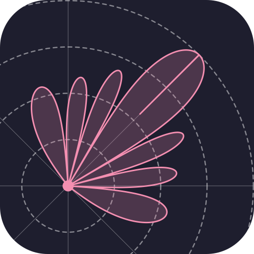

<!-- =====================================================================
  BeamScope project page (formerly Antenna Array Analysis).
  All classes are prefixed "bsc-"; colours come from the site palette in
  src/styles/theme.css. Keep this block free of blank lines, or Markdown
  takes over part way through.
====================================================================== -->

  <!-- Intro -->
  

    
    

      
BeamScope is a desktop tool for designing antenna arrays. Set the element count, spacing, window, and steering angle, and the radiation pattern updates right away in 2D and 3D, without writing a script for each experiment.

      

        <a class="bsc-btn bsc-btn-primary" href="https://github.com/rookiepeng/beamscope/releases/latest">Download <small>Windows · macOS · Linux</small></a>
        <a class="bsc-btn bsc-btn-dark" href="https://github.com/rookiepeng/beamscope">Source on GitHub</a>
        <a class="bsc-btn bsc-btn-ghost" href="https://github.com/rookiepeng/arraybeam">arraybeam library</a>
      

    

  

  
<b>Renamed</b>This project used to be called <strong>Antenna Array Analysis</strong>. Installers up to v3.1.0 still use the old name.

  <!-- Demo -->
  <section>
    

      
    

    

      
<b>1024</b>elements per axis

      
<b>5</b>window functions

      
<b>±90°</b>steering in az and el

      
<b>4</b>pattern views

    

  </section>
  <!-- Background -->
  <section>
    

      <h2>Background</h2>
      
Why it exists

      
In my work I often need to evaluate different antenna array configurations, varying element counts, spacings, window functions, and beam steering angles, and compare how each choice affects the radiation pattern. For a while I did this with one-off Python scripts, running them and piecing together plots. It worked, but it was slow and tedious every time I wanted to change a parameter.

      
I wanted something interactive: change a slider and see the pattern update right away. So I built this tool for myself. Over time it grew from a simple linear-array calculator into a fuller application that handles uniform rectangular arrays, arbitrary custom arrays, per-element patterns, and several plot modes. The goal has stayed the same: make it as easy as possible to explore array designs without rewriting code for every experiment.

    

  </section>
  <!-- Workflow -->
  <section>
    <h2>Design an Array</h2>
    
Layout · weights · pattern

    

      

        <h3>Lay out the elements</h3>
        <ul>
          <li><strong>Uniform rectangular:</strong> set the horizontal (y) and vertical (z) axes separately, each with up to 1024 elements, its own spacing in λ, and its own window.</li>
          <li><strong>Custom array:</strong> place each element anywhere (y, z in λ) with its own amplitude and phase. Type them in or import a CSV file.</li>
        </ul>
      

      

        <h3>Shape the beam</h3>
        <ul>
          <li><strong>Windows</strong> taper each axis to trade main-lobe width for sidelobe level.</li>
          <li><strong>Steering</strong> points the main beam anywhere from −90° to +90° in azimuth and elevation.</li>
          <li><strong>Element pattern:</strong> optionally weight the array by a single element's gain, given as angle and dB tables for azimuth and elevation, typed in or imported from CSV.</li>
        </ul>
      

      

        <h3>Read the pattern</h3>
        
Switch between four pattern views, check the array layout colored by weight, and export the configuration and the computed pattern to CSV for use elsewhere.

        
Your settings are saved, so the app reopens with the array you left.

      

    

    

      <table class="bsc-table">
        <thead><tr><th>Window</th><th>What it does</th><th>Controls</th></tr></thead>
        <tbody>
          <tr><th>Square</th><td>Uniform weights. The narrowest main lobe, with the first sidelobe at about −13 dB.</td><td>none</td></tr>
          <tr><th>Chebyshev</th><td>All sidelobes at the same level you choose, with the narrowest main lobe possible for that level.</td><td>SLL dB</td></tr>
          <tr><th>Taylor</th><td>The nearest sidelobes held near a chosen level, with the rest falling off further out. The usual choice for radar arrays.</td><td>SLL dB n̄</td></tr>
          <tr><th>Hamming</th><td>A fixed taper with sidelobes around −43 dB.</td><td>none</td></tr>
          <tr><th>Hann</th><td>A fixed taper with sidelobes around −31 dB that fall off quickly with angle.</td><td>none</td></tr>
        </tbody>
      </table>
    

  </section>
  <!-- Views -->
  <section>
    <h2>Pattern Views</h2>
    
Plotly, interactive

    

      

        <svg viewBox="0 0 160 84" aria-hidden="true"><g fill="none" stroke="#5b8ff5" stroke-width="1.2"><path d="M14 66 L52 56 L80 14 L108 56 L146 66" /><path d="M14 66 L40 72 L80 50 L120 72 L146 66" opacity=".5" /><path d="M40 72 L52 56 M120 72 L108 56 M80 50 L80 14" opacity=".5" /></g></svg>
        <strong>3D surface</strong>Amplitude over azimuth and elevation, for the whole pattern at once.
      

      

        <svg viewBox="0 0 160 84" aria-hidden="true"><g fill="none" stroke="#5b8ff5" stroke-width="1.2"><ellipse cx="80" cy="42" rx="14" ry="34" /><ellipse cx="80" cy="42" rx="34" ry="12" opacity=".5" /><ellipse cx="38" cy="42" rx="8" ry="6" opacity=".6" /><ellipse cx="122" cy="42" rx="8" ry="6" opacity=".6" /></g></svg>
        <strong>3D polar</strong>The beam as a shape in space, with the main lobe and sidelobes as real lobes.
      

      

        <svg viewBox="0 0 160 84" aria-hidden="true"><path d="M10 74 H150 M10 74 V8" stroke="#3a414d" /><path d="M12 72 L22 58 L30 70 L40 50 L50 68 L58 38 L66 64 L72 14 L80 8 L88 14 L94 64 L102 38 L110 68 L120 50 L130 70 L138 58 L148 72" fill="none" stroke="#5b8ff5" stroke-width="1.2" /></svg>
        <strong>2D Cartesian</strong>A single azimuth or elevation cut in dB against angle, for reading sidelobe levels.
      

      

        <svg viewBox="0 0 160 84" aria-hidden="true"><g fill="none" stroke="#3a414d"><path d="M28 78 A52 52 0 0 1 132 78" /><path d="M50 78 A30 30 0 0 1 110 78" /><path d="M80 78 V26" /></g><path d="M80 78 L74 30 Q80 22 86 30 Z M80 78 L56 56 Q54 50 60 52 Z M80 78 L104 56 Q106 50 100 52 Z" fill="rgba(91,143,245,.25)" stroke="#5b8ff5" stroke-width="1.2" /></svg>
        <strong>2D polar</strong>The same cut on a polar grid, with an adjustable dB floor.
      

    

    

      
<strong>3D inset</strong>The 2D views include a small 3D pattern you can drag anywhere, so the cut always has its context.

      
<strong>Array layout</strong>Shows where every element sits, colored by its weight amplitude or phase.

      
<strong>CSV in and out</strong>Import element positions and element patterns; export the array configuration and the pattern data.

    

  </section>
  <!-- Architecture -->
  <section>
    <h2>How It Works</h2>
    
Electron front end · Python engine

    

      
<b>Renderer</b>TypeScript UI with Plotly.js charts

      
⇄

      
<b>Main process</b>Electron, keeps the bridge running

      
⇄

      
<b>Bridge</b>One JSON line in on stdin, one out on stdout

      
⇄

      
<b>arraybeam</b>NumPy and SciPy pattern math

    

    
The Electron main process starts the Python bridge once and keeps it running, so each change costs one JSON round trip rather than a new Python process. The pattern math lives in <a href="https://github.com/rookiepeng/arraybeam">arraybeam</a>, my array-pattern library, included as a git submodule. In the installers, PyInstaller bundles the bridge into a standalone executable, so no Python install is needed.

    

      ElectronTypeScriptPlotly.jsPythonarraybeamNumPySciPyPyInstallerelectron-builder
    

  </section>
  <!-- Get started -->
  <section class="bsc-cockpit">
    <h2>Get Started</h2>
    
Installers for every desktop

    

      
<b>Windows</b>
Run the Squirrel installer (<code>.exe</code>).

      
<b>macOS</b>
Open the <code>.dmg</code> and drag BeamScope into Applications.

      
<b>Linux</b>
Make the <code>.AppImage</code> executable and run it.

    

    
All three are on the <a href="https://github.com/rookiepeng/beamscope/releases/latest">releases page</a>, with the Python engine bundled inside.

    

      

        <h3>Run from source</h3>
        
Needs Node.js 26+ and Python 3.9+. Clone with the arraybeam submodule:

<pre><code>git clone --recurse-submodules https://github.com/rookiepeng/beamscope.git
cd beamscope
npm install
pip install -r requirements.txt
npm start</code></pre>
        
If you cloned without submodules, run <code>git submodule update --init</code>.

      

      

        <h3>Build an installer</h3>
        
Freeze the Python bridge, then package the app. The output in <code>dist/</code> is a Squirrel installer, DMG, or AppImage depending on the platform you build on.

<pre><code>python scripts/build_bridge.py
npm run dist</code></pre>
      

    

  </section>
  

    GPL-3.0 · feedback welcome
    <a href="https://github.com/rookiepeng/beamscope/issues">Issues</a> · <a href="https://github.com/rookiepeng/beamscope/releases">Releases</a> · <a href="https://github.com/rookiepeng/arraybeam">arraybeam</a>
  

