

  

    

      
A palm-sized 5.8-GHz radar that works in two modes. In <strong>FMCW</strong> mode it measures range, so it can map and track people. In <strong>interferometry</strong> mode it holds a single frequency and picks up tiny motions such as breathing and heartbeat. An on-board microcontroller switches between the two, and both modes share the same RF parts and signal paths, which keeps the radar small and cheap.

      
I used it to locate people among parked cars, track walkers in a cluttered corridor, detect falls, and record the Doppler signatures of wind turbines.

      
Ph.D. researchTexas Tech University2015–2017

    

    <dl class="rp-facts">
      
<dt>Frequency</dt><dd>5.8 GHz (C-band)</dd>

      
<dt>Modes</dt><dd>FMCW and interferometry, on one RF chain</dd>

      
<dt>Size</dt><dd>50 × 60 × 20 mm, two stacked boards</dd>

      
<dt>Controller</dt><dd>TI MSP430</dd>

      
<dt>Data capture</dt><dd>A laptop sound card</dd>

    </dl>
  

  <figure class="rp-monitor">
    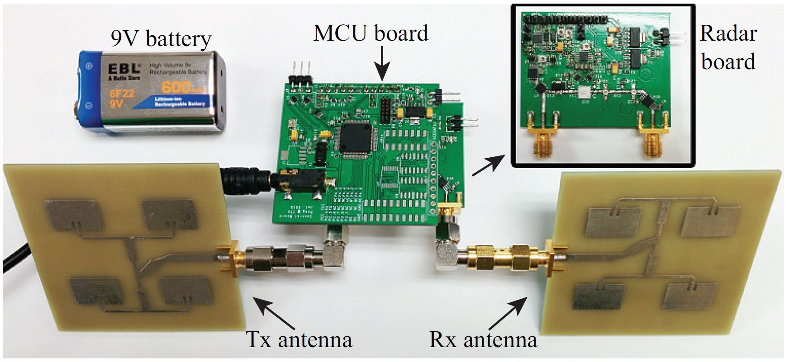
    <figcaption><b>Fig. 1</b>The 5.8-GHz multi-mode radar prototype</figcaption>
  </figure>
  

    
<b>5.8 GHz</b>carrier frequency

    
<b>2</b>radar modes, one RF chain

    
<b>21.6°</b>beamwidth with the 4 × 4 array

    
<b>4</b>applications tested in the field

  

  <section>
    <h2>Design</h2>
    
Low cost by sharing everything

    <figure class="rp-fig">
      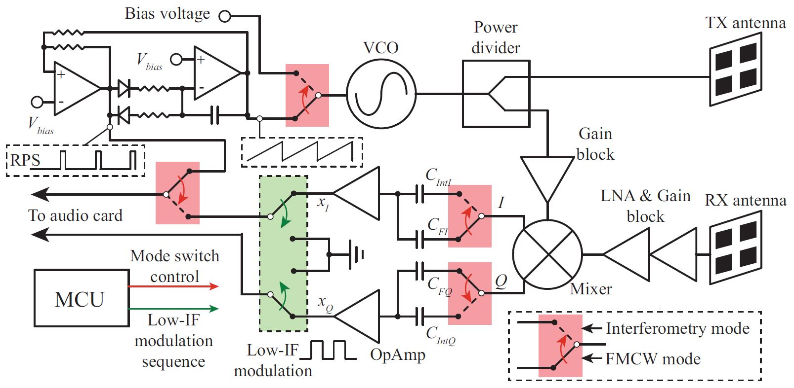
      <figcaption><b>Fig. 2</b>Block diagram of the 5.8-GHz multi-mode radar prototype</figcaption>
    </figure>
    

      
Fig. 2 shows the architecture. Both modes run through the same RF front end and baseband amplifiers, and the baseband signal is sampled by an ordinary laptop sound card instead of a dedicated data-acquisition board.

      <h3>Interferometry mode: a low-IF trick for vital signs</h3>
      
Breathing and heartbeat produce baseband signals below a few hertz. A sound card's input filter blocks frequencies that low, so the radar shifts them up first: a programmable <strong>low-IF modulation</strong> moves the baseband signal to an intermediate frequency the sound card can pass. This also moves the signal away from the flicker noise that crowds the spectrum near DC. After sampling, envelope detection recovers the vital signs. In the paper I analyze the distortion that low-IF modulation introduces and how to get the best sensitivity from envelope detection.

      <h3>FMCW mode: coherence without a PLL</h3>
      
A free-running VCO, driven by a sawtooth from a simple op-amp circuit, generates the frequency sweep. A free-running sweep is not locked to anything, so the radar also records a <strong>reference pulse sequence</strong> that is locked to the sawtooth. Sampling it alongside the beat signal marks the start of every chirp, which makes the FMCW measurements coherent.

    

  </section>
  <section>
    <h2>Hardware</h2>
    
Two boards, two antenna options

    

      
The prototype in Fig. 1 is two PCBs stacked together. The top board carries the MSP430 microcontroller. The bottom board is the radar itself: the sawtooth and reference generator, the RF front end, and the baseband amplifiers. Depending on the experiment, it uses one of two patch-antenna arrays:

    

    

      <table class="rp-table">
        <thead><tr><th>Antenna</th><th>Gain</th><th>Half-power beamwidth</th><th>Trade-off</th></tr></thead>
        <tbody>
          <tr><th>2 × 2 patch array</th><td>11.3 dB</td><td>46°</td><td>Wider coverage</td></tr>
          <tr><th>4 × 4 patch array</th><td>16.3 dB</td><td>21.6°</td><td>Longer range, finer angular resolution</td></tr>
        </tbody>
      </table>
    

  </section>
  <section>
    <h2>Experiments</h2>
    
What the radar can do

    

      

        <h3>Finding a person among parked cars</h3>
        
To build a 2-D map, I rotated the radar mechanically and recorded a range profile in each direction (Fig. 3). In the resulting map (Fig. 4), the strong echo at about 8 m is a car and a person standing next to it. They show up as one target because the 21.6° beam is too wide to separate them, and a portable radar cannot carry an antenna large enough for a much narrower beam. The echoes on the left are other parked cars.

        
A person, however, is never perfectly still: breathing and small body movements make their echo fluctuate from scan to scan. Taking the standard deviation of repeated scans in each direction keeps the person and removes everything that does not move, including the parked car with its engine running (Fig. 5).

        

          <figure class="rp-fig">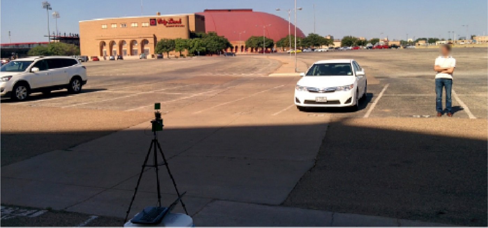<figcaption><b>Fig. 3</b>Setup for the two-dimensional scan</figcaption></figure>
          <figure class="rp-fig">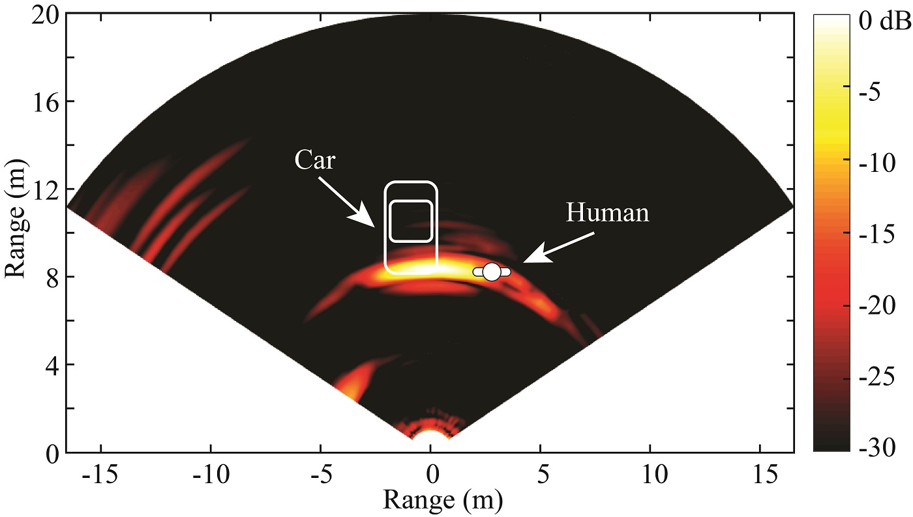<figcaption><b>Fig. 4</b>2-D map built from the measured range profiles</figcaption></figure>
        

        <figure class="rp-fig rp-narrow">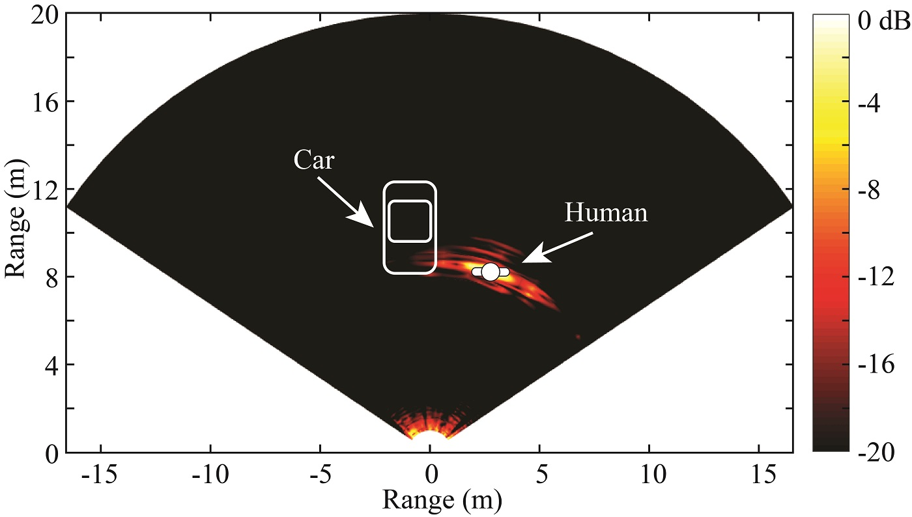<figcaption><b>Fig. 5</b>After suppressing stationary returns, only the human remains</figcaption></figure>
      

      

        <h3>Tracking two people in a cluttered corridor</h3>
        
Two people walked in opposite directions in front of the radar, in a narrow corridor full of walls and pillars (Fig. 6). In the range profiles over the 73-second recording (Fig. 7), the strong vertical stripes are stationary clutter, and the two walkers appear as much fainter traces.

        
Adding Doppler to range separates them. In the range-Doppler frames (Fig. 8), each person appears as a distinct target that can be followed from frame to frame, which is the basis for short-range tracking in healthcare or driverless-vehicle applications.

        

          <figure class="rp-fig">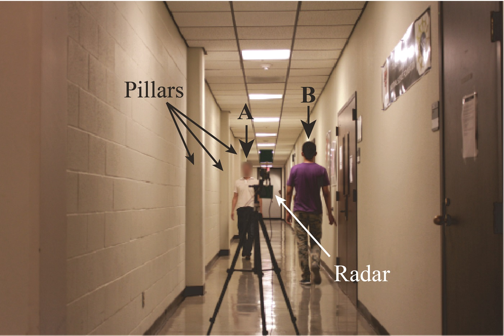<figcaption><b>Fig. 6</b>The corridor used for the experiment</figcaption></figure>
          <figure class="rp-fig">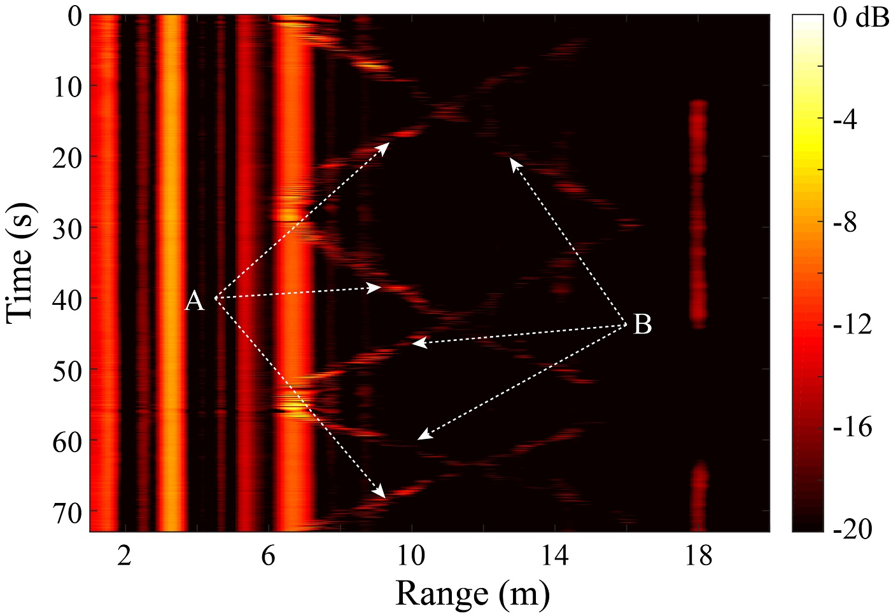<figcaption><b>Fig. 7</b>Range profiles over the 73-s recording</figcaption></figure>
        

        <figure class="rp-fig">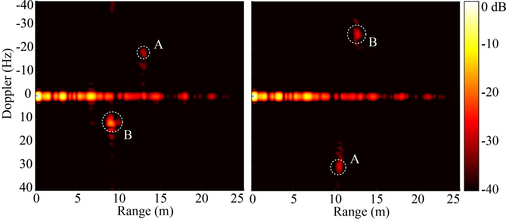<figcaption><b>Fig. 8</b>Frames of the range-Doppler images</figcaption></figure>
      

      

        <h3>Monitoring wind turbines</h3>
        

          

            
The American Wind Power Center in Lubbock, Texas, has wind turbines in many sizes, with different numbers of blades and with horizontal or vertical rotation axes. I aimed the radar at them (Fig. 10) and recorded their micro-Doppler signatures. Fig. 9 shows the spectrogram of a Vestas V47. Signatures like this can be used to monitor the structural health of the turbine.

            <figure class="rp-fig">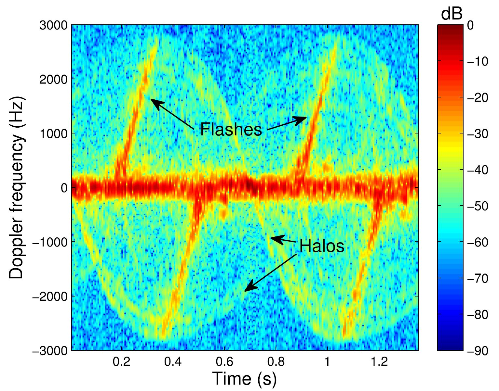<figcaption><b>Fig. 9</b>Spectrogram of the Vestas V47 wind turbine</figcaption></figure>
          

          <figure class="rp-fig rp-narrow"><figcaption><b>Fig. 10</b>Measuring at the American Wind Power Center, Lubbock, TX</figcaption></figure>
        

      

      

        <h3>Detecting falls</h3>
        

          

            
Falls are among the leading causes of fatal and non-fatal injuries in older adults. In this experiment a person fell toward the radar. The fall divides into four phases, each with its own pattern of speed, range, and radar cross section (Fig. 11). These phases appear clearly in the range-Doppler images (Fig. 12), which shows that an FMCW radar can detect falls from range-Doppler imaging in real time.

            <figure class="rp-fig">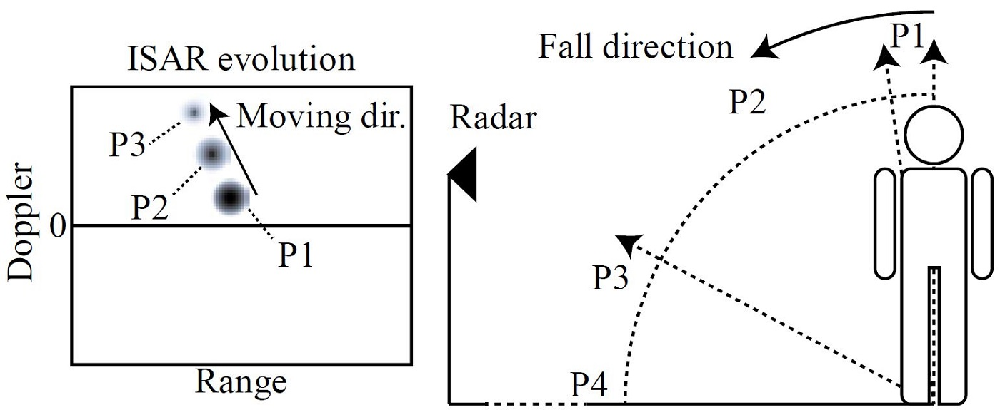<figcaption><b>Fig. 11</b>The four phases of a fall and how the range-Doppler image changes</figcaption></figure>
          

          <figure class="rp-fig rp-narrow">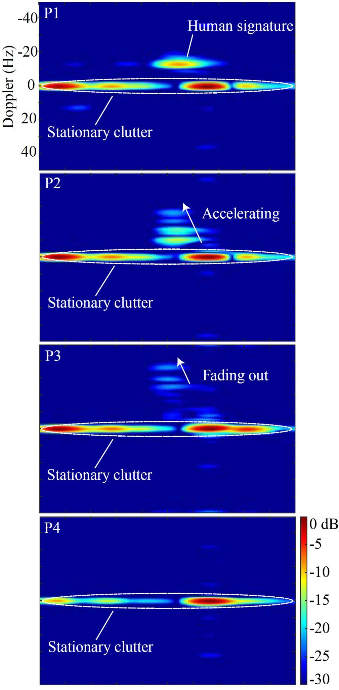<figcaption><b>Fig. 12</b>Measured range-Doppler images of a fall</figcaption></figure>
        

      

    

  </section>
  <section>
    <h2>Publications</h2>
    
Where this work appeared

    <ol class="rp-pubs">
      <li><a href="http://ieeexplore.ieee.org/document/7784794">A portable FMCW-interferometry radar with programmable low-IF architecture for localization, ISAR imaging and vital-sign tracking</a><strong>Z. Peng</strong>, J.-M. Muñoz-Ferreras, Y. Tang, R. Gómez-García, L. Ran, and C. LiJournal<em>IEEE Transactions on Microwave Theory and Techniques</em>, vol. 65, no. 4, pp. 1334–1344, Apr. 2017</li>
      <li><a href="http://ieeexplore.ieee.org/document/7487021">Short-range Doppler-radar signatures from industrial wind turbines: theory, simulations, and measurements</a>J.-M. Muñoz-Ferreras, <strong>Z. Peng</strong>, Y. Tang, R. Gómez-García, D. Liang, and C. LiJournal<em>IEEE Transactions on Instrumentation and Measurement</em>, vol. 65, no. 9, pp. 2108–2119, Sep. 2016</li>
      <li><a href="http://ieeexplore.ieee.org/document/7965798">An FMCW radar sensor for human gesture recognition in the presence of multiple targets</a><strong>Z. Peng</strong>, J.-M. Muñoz-Ferreras, C. Li, and R. Gómez-GarcíaConference<em>IEEE International Microwave Bio-Conference (IMBioC)</em>, Göteborg, Sweden, May 2017</li>
      <li><a href="http://ieeexplore.ieee.org/document/7878741">Doppler-radar-based short-range acquisitions of time-frequency signatures from an industrial-type wind turbine</a>J.-M. Muñoz-Ferreras, <strong>Z. Peng</strong>, Y. Tang, R. Gómez-García, and C. LiConference<em>IEEE Wireless Sensors and Sensor Networks (WiSNet)</em>, Phoenix, AZ, Jan. 2017</li>
      <li><a href="http://ieeexplore.ieee.org/document/7540121">FMCW radar fall detection based on ISAR processing utilizing the properties of RCS, range, and Doppler</a><strong>Z. Peng</strong>, J.-M. Muñoz-Ferreras, R. Gómez-García, and C. LiConference<em>IEEE International Microwave Symposium (IMS)</em>, San Francisco, CA, May 2016</li>
    </ol>
  </section>
  

    Part of my Ph.D. research at Texas Tech University
    <a href="/research-projects/">All research projects</a> · <a href="/publications/">Publications</a>
  

