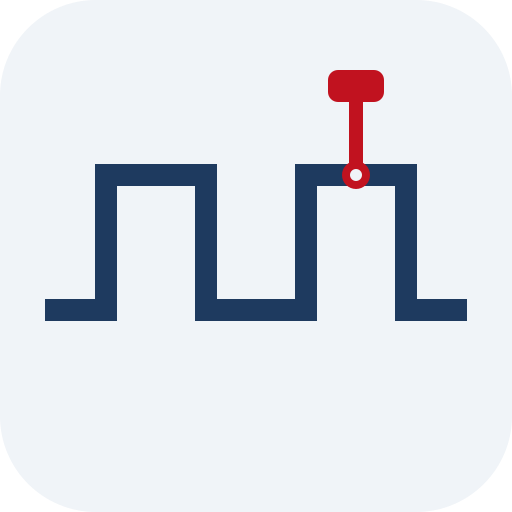

<!-- =====================================================================
  CommProbe project page (formerly Socket Test).
  All classes are prefixed "cpb-"; colours come from the site palette in
  src/styles/theme.css. Keep this block free of blank lines, or Markdown
  takes over part way through.
====================================================================== -->

  <!-- Intro -->
  

    
    

      
CommProbe is a desktop tool for testing communication links. Open a TCP server, fire UDP packets, talk to a Bluetooth device, watch a CAN bus, or query a lab instrument over GPIB, all from one window with one timestamped log.

      

        <a class="cpb-btn cpb-btn-primary" href="https://github.com/rookiepeng/comm-probe">Source on GitHub</a>
        <a class="cpb-btn cpb-btn-dark" href="#cpb-start">Get started <small>Python 3 · PySide6</small></a>
        <a class="cpb-btn cpb-btn-ghost" href="https://github.com/rookiepeng/comm-probe/issues">Report an issue</a>
      

    

  

  
<b>Renamed</b>This project used to be called <strong>Socket Test</strong>. The packaged releases on GitHub (up to v4.1) still use the old name.

  <!-- Demo -->
  <section>
    

      
    

    

      
<b>5</b>protocols, one window

      
<b>5</b>CAN interface types

      
<b>1 Mbps</b>top CAN bitrate

      
<b>1 ms</b>log timestamp resolution

    

  </section>
  <!-- Background -->
  <section>
    

      <h2>Background</h2>
      
From socket tester to protocol probe

      
CommProbe started in 2017 as <strong>Socket Test</strong>, a small PyQt utility for sending and receiving test messages over TCP and UDP. When you are bringing up a device or a piece of firmware, you often just need something on the other end of the link that shows exactly what arrives and lets you send a reply by hand.

      
Over the years it picked up more of the links I work with: GPIB for lab instruments, then Bluetooth, and finally CAN. By then it was no longer a socket tool, so version 5 gave it a new name, a cleaner interface, and a code base split into one handler per protocol.

      <ol class="cpb-time">
        <li><b>2017</b><strong>Socket Test</strong>TCP and UDP in PyQt</li>
        <li><b>2021</b><strong>PySide6 + GPIB</strong>Instruments through PyVISA</li>
        <li><b>2022</b><strong>Bluetooth</strong>RFCOMM server and client</li>
        <li><b>2026</b><strong>CAN</strong>Five bus backends via python-can</li>
        <li class="cpb-now"><b>v5</b><strong>CommProbe</strong>New name, echo, repeat timers</li>
      </ol>
    

  </section>
  <!-- Protocols -->
  <section>
    <h2>Five Protocols</h2>
    
One tab each · shared log on the right

    

      

        <h3>TCP <small>Server + client</small></h3>
        <ul>
          <li>The <strong>server</strong> listens on any network interface and port; the <strong>client</strong> connects to an IP and port. Both sit on the same tab, so you can loop one back to the other.</li>
          <li><strong>Echo</strong> sends every received message back to the client.</li>
        </ul>
      

      

        <h3>UDP <small>Listen + send</small></h3>
        <ul>
          <li>Listens on a chosen interface and port.</li>
          <li>Sends to any target IP and port, so it works for unicast tests and for talking to devices that broadcast status packets.</li>
        </ul>
      

      

        <h3>Bluetooth <small>RFCOMM</small></h3>
        <ul>
          <li>The <strong>server</strong> binds to a local MAC address and RFCOMM channel.</li>
          <li>The <strong>client</strong> connects to a remote MAC address and channel, for serial-style links to modules and microcontrollers.</li>
        </ul>
      

      

        <h3>CAN <small>python-can</small></h3>
        <ul>
          <li>Works with <strong>socketcan</strong>, <strong>PCAN</strong>, <strong>Vector</strong>, <strong>Kvaser</strong>, and a <strong>virtual</strong> bus for testing without hardware.</li>
          <li>Bitrates of 125 k, 250 k, 500 k, and 1 Mbps.</li>
          <li>Standard 11-bit or <strong>extended 29-bit</strong> arbitration IDs. IDs and data are typed in hex, with data as space-separated bytes.</li>
          <li>For Vector hardware, the app registers as <code>CANalyzer</code> in Vector Hardware Config.</li>
        </ul>
      

      

        <h3>GPIB <small>PyVISA</small></h3>
        <ul>
          <li>Lists every VISA resource it can find. Pick one and click <strong>Open</strong>.</li>
          <li><strong>Query</strong> writes a command and reads the reply (for example <code>*IDN?</code>); <strong>Write</strong> only sends.</li>
          <li>Uses NI-VISA when installed, or the pure-Python pyvisa-py backend. If neither is found, the tab says so instead of failing.</li>
        </ul>
      

    

    

      <table class="cpb-table">
        <thead><tr><th>CAN bus type</th><th>Channel</th><th>Notes</th></tr></thead>
        <tbody>
          <tr><th>socketcan</th><td>can0</td><td>Linux kernel CAN interfaces.</td></tr>
          <tr><th>pcan</th><td>PCAN_USBBUS1</td><td>PEAK-System adapters.</td></tr>
          <tr><th>vector</th><td>0</td><td>Zero-based channel index, mapped under the <code>CANalyzer</code> application.</td></tr>
          <tr><th>kvaser</th><td>0</td><td>Zero-based channel index.</td></tr>
          <tr><th>virtual</th><td>0</td><td>In-process bus, handy for trying the app with no adapter.</td></tr>
        </tbody>
      </table>
    

  </section>
  <!-- Shared features -->
  <section>
    <h2>One Log for Everything</h2>
    
Tools shared by every tab

[12:46:37.954] <strong>↑ [TCP Client] 127.0.0.1</strong>

Test

[12:46:37.961] <strong>↓ [TCP Client] 127.0.0.1:64865</strong>

Test

[12:46:38.102] <strong>↓ [CAN RX] Arb ID: 0x18FF50E5</strong>

01 02 03 04 05 06 07 08

    

      
<strong>Timestamped log</strong>Every message gets a millisecond timestamp, a direction arrow, and its source. Incoming traffic is shown in blue.

      
<strong>Repeat timer</strong>TCP and UDP can resend the last message on an interval in milliseconds, for soak tests and heartbeat checks.

      
<strong>Connection status</strong>The status bar shows who is connected to what, for the tab you are on.

      
<strong>Remembers your setup</strong>Interfaces, ports, addresses, and the last tab are saved to <code>config.json</code> and restored at launch.

    

  </section>
  <!-- Architecture -->
  <section>
    <h2>How It Works</h2>
    
Qt front end · one worker thread per link

    

      
<b>Main window</b>Qt Designer layout loaded at runtime

      
⇄

      
<b>Handlers</b>One module per protocol tab

      
⇄

      
<b>Workers</b>Socket, CAN, or VISA I/O on a QThread

      
⇄

      
<b>Log</b>Qt signals carry each message back

    

    
Each protocol tab has its own handler that wires up the controls and starts a worker on a separate <code>QThread</code>, so a slow device or a blocking socket never freezes the window. Workers report back through Qt signals, and every message goes into the same log. <code>psutil</code> lists the network interfaces with their IPv4 addresses, and PyInstaller packages the whole app into a folder you can run without Python installed.

    

      PythonPySide6Qt Designerpsutilpython-canPyVISApyvisa-pyPyInstallerGitHub Actions
    

  </section>
  <!-- Get started -->
  <section class="cpb-cockpit" id="cpb-start">
    <h2>Get Started</h2>
    
Run from source on Windows or Linux

    

      
<b>Required</b>
<code>PySide6</code> for the interface and <code>psutil</code> for network interfaces.

      
<b>For CAN</b>
<code>python-can</code>, plus the driver for your adapter.

      
<b>For GPIB</b>
<code>pyvisa</code> with NI-VISA, or <code>pyvisa-py</code> on its own.

    

    

      

        <h3>Run</h3>
        
The requirements file installs everything, including the optional CAN and GPIB packages:

<pre><code>git clone https://github.com/rookiepeng/comm-probe.git
cd comm-probe
pip install -r requirements.txt
python commprobe.py</code></pre>
      

      

        <h3>Build a standalone app</h3>
        
PyInstaller bundles the app, its layout, and its icons into <code>dist/commprobe</code>:

<pre><code>pip install pyinstaller
pyinstaller commprobe.spec</code></pre>
        
GitHub Actions builds the same package for Windows and Linux on every push.

      

    

  </section>
  

    GPL-3.0 · feedback welcome
    <a href="https://github.com/rookiepeng/comm-probe/issues">Issues</a> · <a href="https://github.com/rookiepeng/comm-probe/releases">Releases</a> · <a href="https://github.com/rookiepeng/comm-probe">GitHub</a>
  

