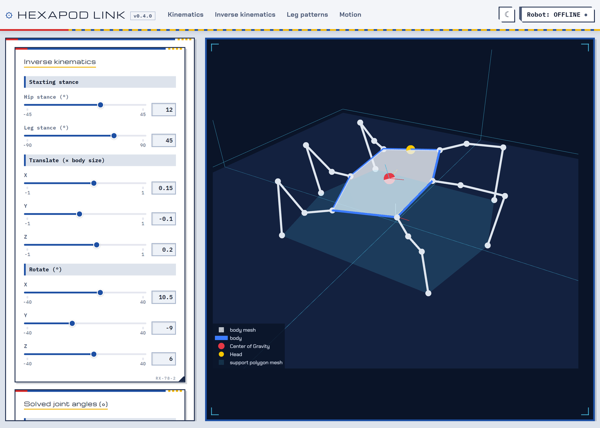
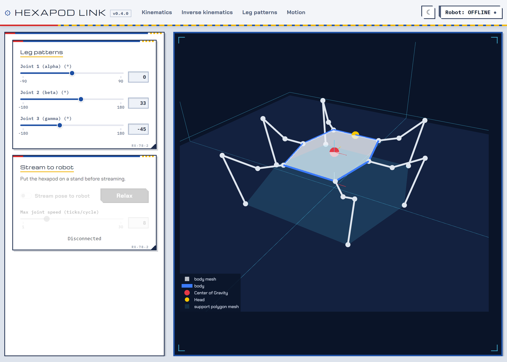

<!-- =====================================================================
  Hexapod Link project page (repo: rookidroid/hexapod-link).
  All classes are prefixed "hxl-"; colours come from the site palette in
  src/styles/theme.css. Keep this block free of blank lines, or Markdown
  takes over part way through.
====================================================================== -->

  <!-- Intro -->
  

    
    

      
Hexapod Link is a hexapod robot simulator with forward and inverse kinematics and gait animation, and a remote for the real thing: connect it to a <a href="/2024/09/12/hexapod/">RookiDroid hexapod</a> and the same controls drive the physical robot over WiFi, from a single joint up to a whole gait. It runs in the browser or as a desktop app.

      

        <a class="hxl-btn hxl-btn-primary" href="https://github.com/rookidroid/hexapod-link">Source on GitHub</a>
        <a class="hxl-btn hxl-btn-dark" href="https://github.com/rookidroid/hexapod-link/actions/workflows/build-desktop.yml">Desktop builds <small>Windows · Linux</small></a>
        <a class="hxl-btn hxl-btn-ghost" href="https://rookidroid.com/">rookidroid.com</a>
      

    

  

  
<b>Fork</b>Built on <a href="https://github.com/mithi/hexapod-robot-simulator">mithi/hexapod-robot-simulator</a>, extended with a desktop app, real-robot control, and a rebuilt test suite.

  <!-- Demo -->
  <section>
    

      

        
      

      

        
<b>18</b>joints, 3 per leg

        
<b>4</b>control pages

        
<b>100 Hz</b>pose stream

        
<b>3+</b>robots, no app changes

      

    

  </section>
  <!-- Overview -->
  <section>
    

      <h2>Overview</h2>
      
A simulator that talks to the hardware

      
The simulator answers two questions about a six-legged robot. Given the angle of every joint, what does the robot look like? And given where the body should be, what joint angles get it there, and is that pose even possible? It is built from first principles with NumPy, and draws the robot, its center of gravity and its support polygon in an interactive 3D view.

      
Hexapod Link adds the hardware side. The poses you set in the simulator stream to an ESP32 hexapod, and the robot's own built-in gaits can be triggered from the same window. Each robot describes itself when the app connects, so Nougat, Mochi, Macaroon, or a new member of the family all work without touching the app.

    

  </section>
  <!-- Pages -->
  <section>
    <h2>Four Ways to Pose It</h2>
    
Simulate first · then drive the robot

    

      

        <figure></figure>
        
<h3>Kinematics</h3>
Set all 18 joint angles by hand and watch the body follow.
<small>Streams every pose to the servos</small>

      

      

        <figure></figure>
        
<h3>Inverse Kinematics</h3>
Translate and rotate the body; the solver finds the joint angles, or says why it can't.
<small>Streams once the pose is reachable</small>

      

      

        <figure></figure>
        
<h3>Leg Patterns</h3>
Sweep all six legs together through one set of angles.
<small>Streams every pose to the servos</small>

      

      

        <figure></figure>
        
<h3>Motion</h3>
Play the generated gaits frame by frame and scrub through them, then run the same motion on the robot.
<small class="hxl-flash">Runs the robot's own gait from flash</small>

      

    

  </section>
  <!-- Real robot -->
  <section>
    <h2>Driving a Real Hexapod</h2>
    
Flash · join · connect

    

      

        <h3>Flash the firmware</h3>
        
Use the ESP32 firmware from the <a href="https://github.com/rookidroid/hexapod">hexapod repo</a>. It needs to serve its own config at <code>GET /robot_config</code>.

      

      

        <h3>Join its WiFi</h3>
        
The robot is the access point, so the computer running the app joins it directly. The robot stands up when a client connects.

      

      

        <h3>Connect</h3>
        
Open the <strong>ROBOT</strong> panel from the status button in the navigation bar and connect to <code>192.168.4.1</code>. The stream and run controls light up on the pages that use them.

      

    

    

      
<strong>The robot brings its own config</strong>Leg geometry, joint limits, servo range, gait radii, speed range and its list of commands all come from the robot. The simulated body switches to match, and the last config is cached so the app still shows that robot offline.

      
<strong>Built-in gaits or streamed frames</strong>The Motion page can trigger the robot's own gait, played from flash so WiFi can't make it stutter, or stream the simulator's frames for paths the firmware doesn't have. Gait speed runs from 20 to 100 %.

      
<strong>Calibration</strong>Trim each servo's offset through the robot's calibration routes: enter the calibration posture, apply the offsets, save them to flash, and exit.

      
<strong>Safety</strong>Put the robot on a stand before streaming. Joint angles are clamped to the robot's mechanical limits and each servo's slew rate is capped, and if the stream stops the robot eases back to standby after 1 s.

    

  </section>
  <!-- Architecture -->
  <section>
    <h2>How It Works</h2>
    
Plotly Dash front end · NumPy solvers · WiFi link

    

      
<b>UI</b>Plotly Dash pages and the 3D view

      
→

      
<b>Solvers</b>Forward and inverse kinematics, ground contact, gait paths

      
→

      
<b>Robot link</b>Joint angles to servo ticks, clamped and slew-limited

      
→

      
<b>ESP32</b>Config over HTTP, poses over UDP port 1234

    

    
Legs and joints are numbered the way the firmware numbers them, so a leg picked out in the 3D plot is the leg the calibration page calls by that name. Only the angle convention differs, and the robot link converts it using each leg's mirroring from the robot's config. A fake robot in <code>tools/fake_robot.py</code> stands in for the hardware, and the test suite covers the kinematics, the streaming protocol and config reading without a display, a browser or a robot.

    

      PythonPlotly DashNumPyFlaskwaitresspywebviewPyInstallerpytestGitHub Actions
    

  </section>
  <!-- Get started -->
  <section class="hxl-cockpit">
    <h2>Get Started</h2>
    
Python 3.13+ · browser or desktop window

    

      

        <h3>In the browser</h3>
        
Start the server and open the printed URL.

<pre><code>pip install -r requirements.txt
python hexapod_link.py --no-window --port 8050</code></pre>
      

      

        <h3>As a desktop app</h3>
        
A native window via pywebview, with no browser chrome. Works offline.

<pre><code>pip install -r requirements-desktop.txt
python hexapod_link.py</code></pre>
      

      

        <h3>Without a robot</h3>
        
Run the stand-in robot, then connect to <code>127.0.0.1:8080</code>.

<pre><code>python tools/fake_robot.py nougat</code></pre>
      

    

    
Prebuilt Windows and Linux bundles (about 130 MB) come out of every <a href="https://github.com/rookidroid/hexapod-link/actions/workflows/build-desktop.yml">build-desktop run</a>, or build your own with <code>pyinstaller hexapod.spec</code> from a minimal virtual environment.

  </section>
  

    MIT · forked from mithi/hexapod-robot-simulator
    <a href="https://github.com/rookidroid/hexapod-link/issues">Issues</a> · <a href="/2024/09/12/hexapod/">Hexapod</a> · <a href="/2023/03/18/remote-arcade/">Arcade Remote</a>
  

