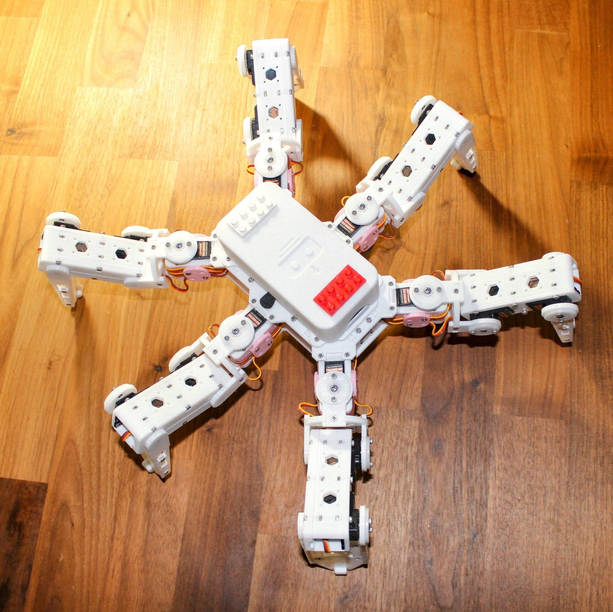
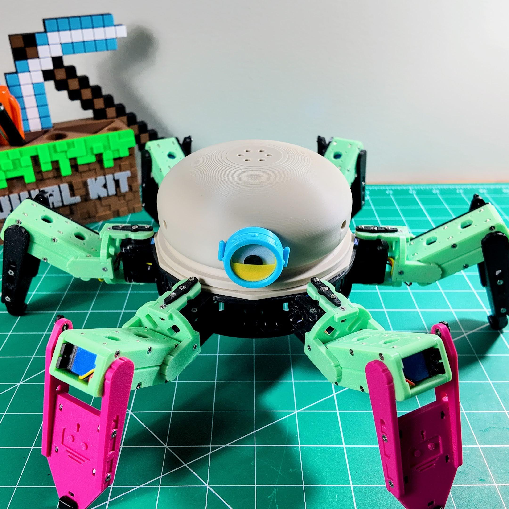

<!-- =====================================================================
  Hexapod Evolution Timeline — RookiDroid
  Paste into a WordPress "Custom HTML" block.
  All classes prefixed "hxt-" to avoid theme conflicts.
  Fonts (Space Grotesk, Inter) are already loaded by the RookiDroid theme.
====================================================================== -->

  <!-- Story -->
  

    <h2>Why I Built This</h2>
    
This project started as something simple: I wanted to build a toy for my kids. A real, walking, six-legged robot they could hold, control, and be genuinely excited about.

    
But as it grew across three generations — through underpowered servos, violent jitter, and a complete chassis redesign — it became something more. Hexapod Mochi is now a platform I hope my kids will one day use to learn the skills that matter: <strong>3D printing</strong>, <strong>electronics</strong>, <strong>coding</strong>, and the engineering mindset of iterating until something actually works.

    
Every design flaw, every failed prototype, and every hard-won fix is part of the story. That&#8217;s the whole point.

  

  <!-- Stats bar -->
  

    

      3
      
Design Generations

    

    

      18
      
Degrees of Freedom

    

    

      MG92B
      
Final Servo Choice

    

  

  <!-- Timeline -->
  

    <!-- V1 -->
    

      

        
        

          &#9679;&nbsp;Version 1
          <h3>The Foundation</h3>
          
The Ambitious Baseline

          
Every great robotics project begins with a simple question: <em>Can I make this move smoothly?</em> The first version was a proof of concept to test leg geometry and basic multi-directional locomotion.

          
Physics caught up quickly. Built around standard <strong>MG90S</strong> micro servos, the robot was fighting an uphill battle — the servos were simply too weak for the combined weight and dynamic forces of walking. The internal wiring layout was clunky and prone to tangling.

          
<strong>Lesson:</strong> Raw servo count doesn&#8217;t matter if torque is insufficient for the chassis weight.

          

            ⚙️ MG90S servos
            🦿 18 DOF
            📐 Rectangular chassis
            ⚠️ Underpowered
          

        

      

      

v1

      

    

    <!-- V2 -->
    

      

      

v2

      

        
        

          &#9679;&nbsp;Version 2
          <h3>The Quest for Power</h3>
          
The Battle Against Jitter

          
To solve v1&#8217;s power deficit, v2 took a brute-force approach. The system was upgraded to support either a <strong>Raspberry Pi Pico</strong> or an <strong>ESP32</strong>, and the legs were completely redesigned to house beefier <strong>21g servos</strong>.

          
In practice, high-quality 21g servos proved frustratingly difficult to source. Sub-par components caused a massive problem: <strong>terrible, violent jittering</strong>. The robot had the power to lift itself but spent more time shaking than walking.

          
<strong>Lesson:</strong> Raw torque is worthless without component quality and signal precision.

          

            ⚙️ 21g servos
            🧠 Pico / ESP32
            🦿 18 DOF
            ⚠️ Severe jitter
          

        

      

    

    <!-- V3 -->
    

      

        
        

          &#9679;&nbsp;Version 3 — Mochi
          <h3>Refinement &amp; Redesign</h3>
          
Form, Function, and the Perfect Fit

          
The breakthrough came with the <strong>MG92B</strong> servo — the strongest micro servo available that still fits a compact form factor. It delivers high torque without the massive footprint or violent jitter of v2.

          
With hardware dialed in, the chassis was radically transformed. The rectangular body gave way to a <strong>sleek circular layout</strong>, improving symmetry, multidirectional leg clearance, and lending the robot a distinctly friendly personality. Meet <strong>Mochi</strong>.

          
<strong>Result:</strong> Smooth gait, OTA firmware updates, and WiFi UDP control from any device.

          

            ⚙️ MG92B servos
            🧠 ESP32
            🦿 18 DOF
            📶 WiFi UDP
            🔄 OTA updates
            ⭕ Circular chassis
          

          <!-- Instructions -->
          

            

              <h2>&#128218;&nbsp; Build Your Own &#8211; Mochi</h2>
              
Everything you need to 3D print, assemble, wire, and calibrate your Mochi hexapod is now consolidated into one comprehensive, step-by-step build guide.

              <a href="https://rookidroid.com/build-your-own-mochi/" target="_blank" rel="noopener" class="hxt-instr-hero-btn">📖 Read the Full Build Guide</a>
            

            

              <h3>Downloads &amp; Parts</h3>
              

                <!-- 3D Print Files -->
                <a class="hxt-res-card" href="https://rookidroid.com/product/hexapod-mochi/" target="_blank" rel="noopener">
                  🖨️
                  

                    3D Print Files
                    ⬇️ Free Download
                  

                </a>
                <!-- ESP32 Controller -->
                <a class="hxt-res-card" href="https://rookidroid.com/product/hexapod-controller-board-esp32/" target="_blank" rel="noopener">
                  ⚡
                  

                    ESP32 Controller
                    🛒 Shop Part
                  

                </a>
                <!-- Software Bundle -->
                <a class="hxt-res-card" href="https://rookidroid.com/product/hexapod-mochi-arduino-esp32/" target="_blank" rel="noopener">
                  💻
                  

                    Software Bundle
                    ⬇️ Free Download
                  

                </a>
              

            

          

        

      

      

v3

      

    

    <!-- V4 -->
    

      

      

v4

      

        

          🔧
          In Development
          Coming Soon
        

        

          &#9679;&nbsp;Version 4 — Macaroon
          <h3>Hexapod Macaroon</h3>
          
Something Bigger Is Coming

          
Version 4 is currently in development. Based on everything learned across three generations, Macaroon will push the limits further — smarter control, refined mechanics, and even more character.

          
Follow along on <a href="https://rookidroid.com" target="_blank" rel="noopener" style="color:var(--hxt-v4);font-weight:600;">RookiDroid</a> for updates as the build progresses.

        

      

    

  
<!-- /.hxt-timeline -->
  <!-- Design Philosophy -->
  

    

      <h2>&#9881;&#65039;&nbsp; Design Philosophy</h2>
      
Mochi is a six-legged, WiFi-enabled crawler with 18 degrees of freedom and a circular body that balances weight, simplifies wiring, and improves stability. Driven by an ESP32 over a built-in WiFi access point, it supports over-the-air firmware updates and full gait customization. Every structural decision was deliberate.

    

    

      

        &#128200;
        <h4>Layer Orientation</h4>
        
Print layers align with load directions, distributing stress along their length to prevent delamination under walking forces.

      

      

        &#128279;
        <h4>Reinforced Joints</h4>
        
Leg segments and servo mounts feature strengthened connection points that spread loads and minimize stress concentrations.

      

      

        &#9711;
        <h4>Circular Frame</h4>
        
The round body optimizes the weight-to-rigidity ratio for stable locomotion and even servo load distribution across all six legs.

      

      

        &#129521;
        <h4>Modular Assembly</h4>
        
Interlocking components reduce adhesive dependency and make repairs or upgrades straightforward without specialized tools.

      

      

        &#129514;
        <h4>Material Flexibility</h4>
        
Geometry is optimized to perform reliably with standard PLA or PETG, maintaining durability under repeated dynamic stress.

      

      

        &#128241;
        <h4>Full Control Stack</h4>
        
Includes a BOM, wiring diagrams, gait look-up tables, path generation tools, and an Android app for point-and-go control.

      

    

    

      &#9989;&nbsp; BOM included
      &#9989;&nbsp; PLA / PETG compatible
      &#9989;&nbsp; OTA firmware
      &#9989;&nbsp; Android app
      &#9989;&nbsp; Custom gait tools
    

  

<!-- /.hxt-wrap -->
