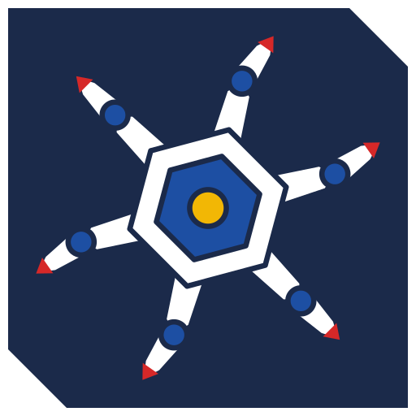
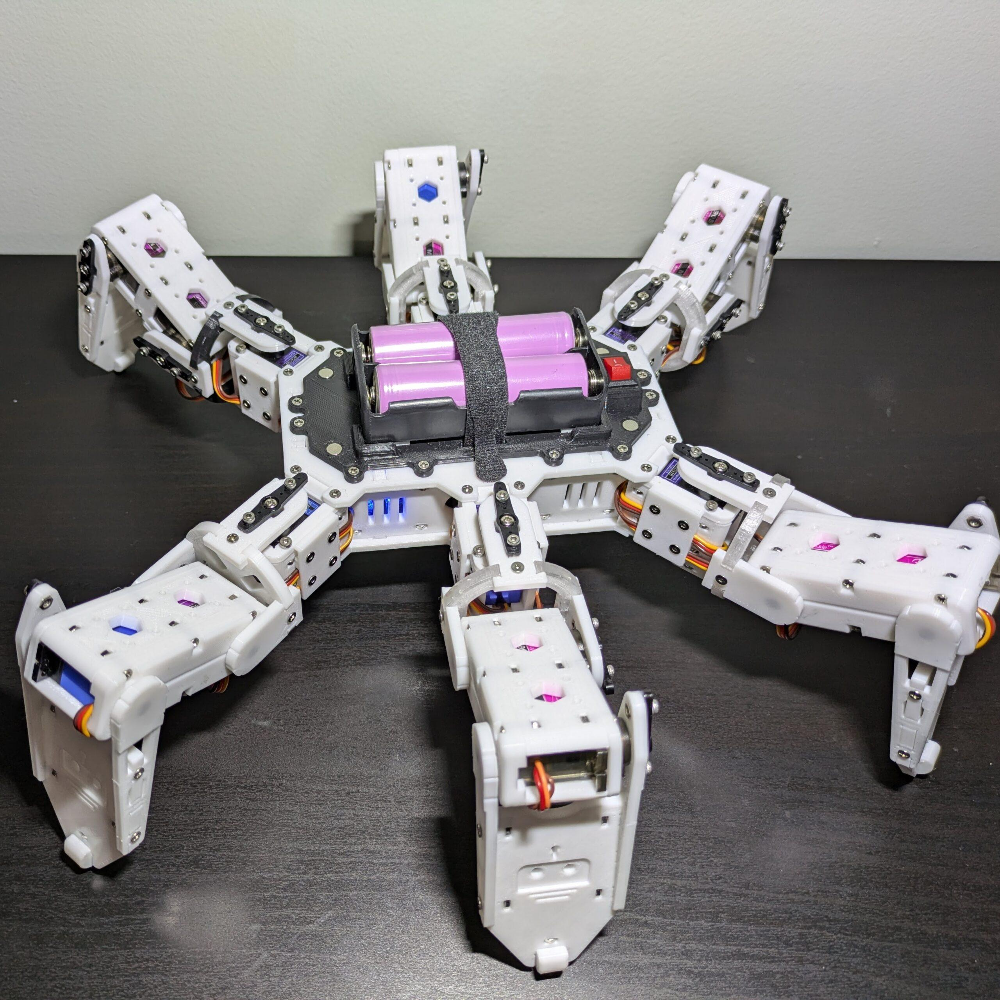
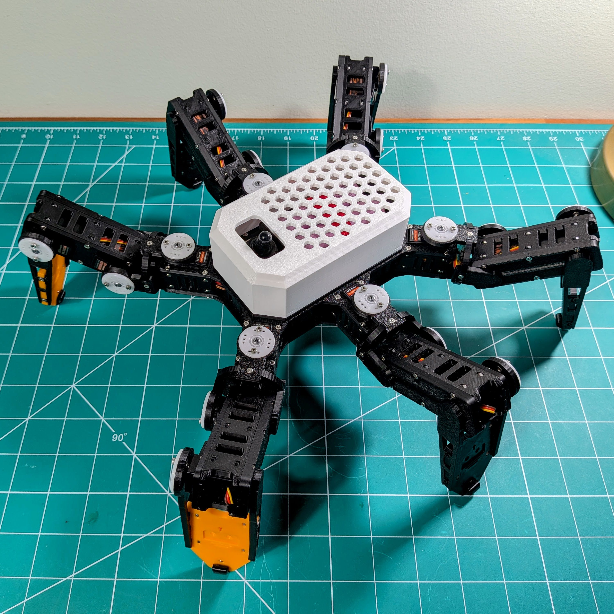
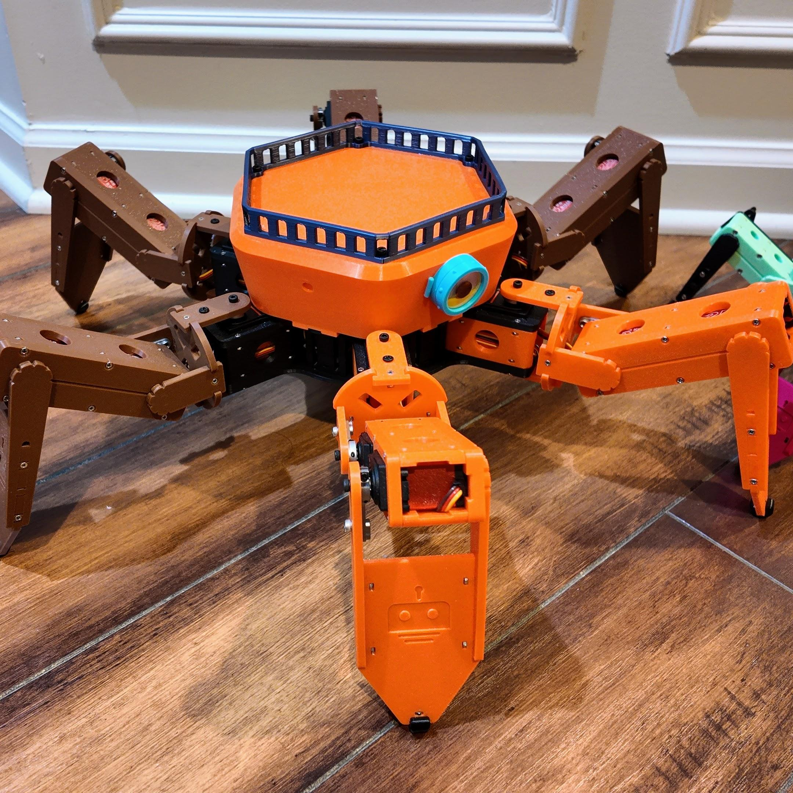
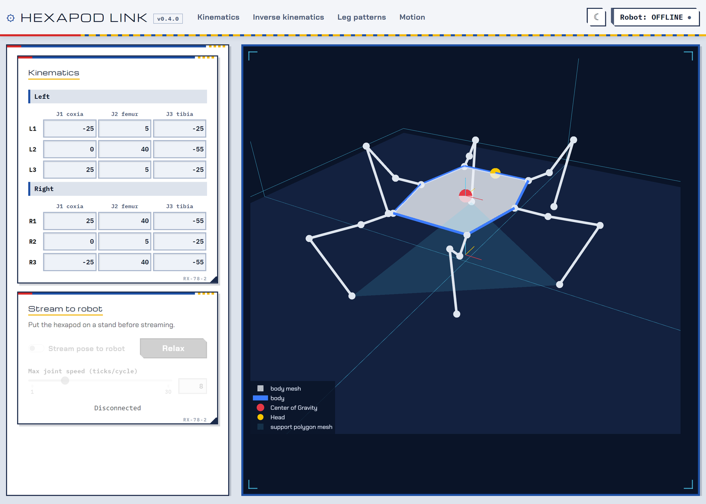
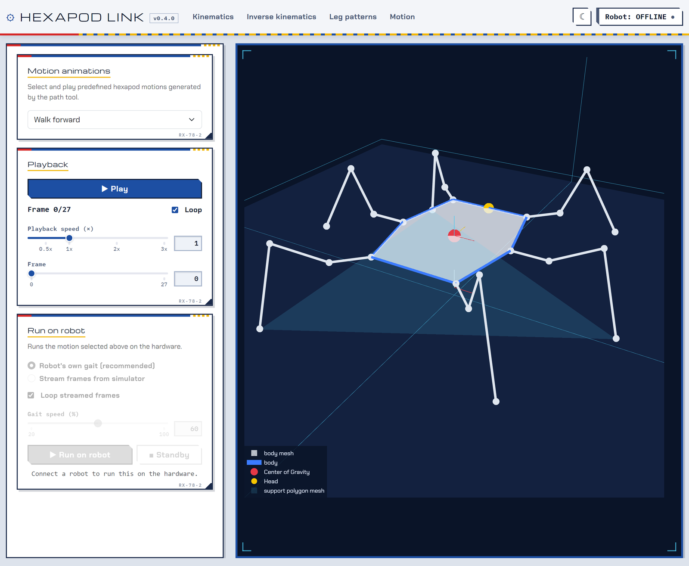

<!-- =====================================================================
  Hexapod project page, covering both repos:
    rookidroid/hexapod       robots, ESP32 firmware, path tool
    rookidroid/hexapod-link  simulator and desktop app that drives them
  All classes are prefixed "hxp-"; colours come from the site palette in
  src/styles/theme.css. Keep this block free of blank lines, or Markdown
  takes over part way through.
====================================================================== -->

  <!-- Intro -->
  

    
    

      
Hexapod is a family of 3D-printed, six-legged robots. Nougat, Mochi and Macaroon each walk on 18 servos, carry an ESP32 and host their own WiFi network, and all three run the same firmware. Its companion, <strong>Hexapod Link</strong>, is a kinematics simulator that models whichever robot it connects to and drives it live, from a single joint up to a whole gait.

      

        <a class="hxp-btn hxp-btn-primary" href="https://github.com/rookidroid/hexapod">Robots &amp; firmware <small>GitHub</small></a>
        <a class="hxp-btn hxp-btn-dark" href="https://github.com/rookidroid/hexapod-link">Hexapod Link <small>GitHub</small></a>
        <a class="hxp-btn hxp-btn-ghost" href="https://rookidroid.com/">Build guides <small>rookidroid.com</small></a>
      

    

  

  
<b>Two repos</b><a href="https://github.com/rookidroid/hexapod">rookidroid/hexapod</a>: hardware, ESP32 firmware and gait generator (GPL-3.0) · <a href="https://github.com/rookidroid/hexapod-link">rookidroid/hexapod-link</a>: simulator and desktop app (MIT)

  <!-- Hero -->
  <section>
    

      <figure class="hxp-monitor">
        
        <figcaption>Mochi · the round-bodied, MG92B build</figcaption>
      </figure>
      

        
<b>3</b>robots, one firmware

        
<b>18</b>servos per robot

        
<b>19</b>built-in motions

        
<b>50 Hz</b>live pose control

      

    

  </section>
  <!-- Story -->
  <section>
    

      <h2>Why I Built This</h2>
      
A toy that turned into a platform

      
This project started as something simple: I wanted to build a toy for my kids. A real, walking, six-legged robot they could hold, control, and be genuinely excited about.

      
It grew across four generations, through underpowered servos, a hunt for real torque, a round redesign and a scaled-up build, and picked up its own software along the way: one firmware shared by every robot, a gait generator that turns each robot's dimensions into motion, and a simulator to work out a pose on screen before the robot ever moves.

      
The hexapods are now a platform I hope my kids will one day use to learn the skills that matter: <strong>3D printing</strong>, <strong>electronics</strong>, <strong>coding</strong>, and the engineering habit of iterating until something actually works. Every prototype and every hard-won fix is part of that story.

    

  </section>
  <!-- Family -->
  <section>
    <h2>The Family</h2>
    
Four generations · three robots you can build today

    

      

        <figure></figure>
        

          Version 1
          <h3>The Foundation</h3>
          
The ambitious baseline

          
A proof of concept for the leg geometry and multi-directional walking. Physics caught up quickly: standard <strong>MG90S</strong> micro servos were too weak for the weight and the dynamic loads of walking, and the wiring tangled.

          
<strong>Lesson:</strong> servo count doesn't matter if the torque can't carry the chassis.

          
MG90S servos18 DOFRectangular bodyRetired

        

      

      

        <figure></figure>
        

          Version 2 · Nougat
          <h3>The Quest for Power</h3>
          
Torque, and the signal to match it

          
Legs redesigned around beefier <strong>21G digital servos</strong>, with an <strong>ESP32</strong> for WiFi. Torque alone wasn't the answer: two <strong>PCA9685</strong> PWM drivers and a power stage sized for all 18 servos turned the extra strength into a steady gait.

          
<strong>Lesson:</strong> torque only pays off when signal precision keeps up with it.

          
21G digital servosESP322 × 18650

          
<a href="https://rookidroid.com/build-your-own-nougat/">Build guide</a><a href="https://rookidroid.com/product/hexapod-nougat/">3D print files</a><a href="https://rookidroid.com/product/hexapod-controller-board-mochi-esp32/">Controller board</a>

        

      

      

        <figure></figure>
        

          Version 3 · Mochi
          <h3>Refinement &amp; Redesign</h3>
          
Form, function and the perfect fit

          
The <strong>MG92B</strong> is the strongest micro servo that still fits a compact frame, with high torque in a smaller footprint than the 21G. That allowed a tighter, <strong>circular body</strong>: better symmetry, more leg clearance in every direction, and a friendlier face.

          
<strong>Result:</strong> the smallest of the family, with a smooth gait.

          
MG92B servosESP322 × 18650Round body

          
<a href="https://rookidroid.com/build-your-own-mochi/">Build guide</a><a href="https://rookidroid.com/product/hexapod-mochi/">3D print files</a><a href="https://rookidroid.com/product/hexapod-controller-board-esp32/">Controller board</a>

        

      

      

        <figure></figure>
        

          Version 4 · Macaroon
          <h3>Scaling Up</h3>
          
The biggest and strongest

          
Eighteen <strong>25 kg digital servos</strong> replace the micro servos, with longer legs and a wider body to match. Four 18650 cells in <strong>2S2P</strong> feed the servos directly at up to 8.4 V through a controller board built for the load.

          
<strong>Result:</strong> the same firmware and controls, with torque to spare.

          
25 kg servosESP324 × 18650 (2S2P)

          
<a href="https://rookidroid.com/build-your-own-macaroon/">Build guide</a><a href="https://rookidroid.com/product/hexapod-macaroon/">3D print files</a><a href="https://rookidroid.com/product/hexapod-controller-board-macaroon-esp32/">Controller board</a>

        

      

    

    

      <table class="hxp-table">
        <thead><tr><th></th><th>Nougat</th><th>Mochi</th><th>Macaroon</th></tr></thead>
        <tbody>
          <tr><th>Servos</th><td>18 × 21G digital</td><td>18 × MG92B micro</td><td>18 × 25 kg digital</td></tr>
          <tr><th>Battery</th><td>2 × 18650 (2S)</td><td>2 × 18650 (2S)</td><td>4 × 18650 (2S2P)</td></tr>
          <tr><th>Coxa / femur / tibia</th><td>38 / 54 / 97 mm</td><td>36 / 44 / 85 mm</td><td>62 / 76 / 132 mm</td></tr>
          <tr><th>Gait frame period</th><td>12 ms</td><td>12 ms</td><td>25 ms</td></tr>
          <tr><th>WiFi network</th><td><code>hexapod_nougat</code></td><td><code>hexapod</code></td><td><code>hexapod_macaroon</code></td></tr>
          <tr><th>Firmware define</th><td><code>ROBOT_NOUGAT</code></td><td><code>ROBOT_MOCHI</code></td><td><code>ROBOT_MACAROON</code></td></tr>
        </tbody>
      </table>
    

    
Each build guide covers the bill of materials, the printed parts, assembly, wiring, software setup, calibration and troubleshooting. The same guides live in the <a href="https://github.com/rookidroid/hexapod/tree/master/robots">robots folder</a> of the repo.

  </section>
  <!-- Firmware -->
  <section>
    <h2>One Firmware for Every Robot</h2>
    
ESP32 · Arduino · two PCA9685 drivers

    

      
All three robots run one Arduino sketch. What differs between them is data: each robot's leg mounts, link lengths, postures, gait radii and joint limits live in one JSON file. The <strong>path tool</strong>, a small NumPy gait generator with its own inverse kinematics, turns that file into look-up tables of servo positions for every motion, and the firmware plays them back. Adding a robot is mostly a matter of writing its JSON.

    

    

      
<b>Geometry</b><code>robots/&lt;name&gt;.json</code>: legs, links, postures, gaits

      
→

      
<b>Path tool</b>Inverse kinematics and gait paths, written out as <code>motion.h</code>

      
→

      
<b>ESP32</b>Plays the tables, streams poses, serves its own config

      
→

      
<b>Clients</b>Browser, Android app, Arcade Remote, Hexapod Link

    

    

      
<strong>19 built-in motions</strong>Walking in eight directions, fast forward and back, turning in place, a climbing gait, body pitch, roll and yaw, and a twist.

      
<strong>Adjustable gait speed</strong>20 to 100 % of each robot's tuned rate. Below full speed the firmware blends between table frames, so slow gaits stay smooth.

      
<strong>Non-blocking motion engine</strong>Gaits, streamed poses and every transition between them run on one tick-driven loop, so the web page and OTA stay responsive while it walks. Gaits change only at the start or middle of a cycle, by way of standby.

      
<strong>Browser calibration</strong>Trim each servo's offset with + and − on the robot's own web page; offsets save to flash, with no recompiling.

      
<strong>Over-the-air updates</strong>After the first USB upload, flash new firmware over WiFi from the Arduino IDE, with an optional password.

      
<strong>Failsafes</strong>The robot returns to standby if motion commands stop for 500 ms, or if a pose stream stops for 1 s. Streamed poses are slew-limited per joint, so a big jump becomes a controlled move.

    

    
Pick the robot by leaving one <code>#define ROBOT_*</code> uncommented in <code>robot.h</code>, or skip that step: every <a href="https://github.com/rookidroid/hexapod/releases">release</a> includes a ready-to-open sketch for each robot.

  </section>
  <!-- Ways to drive -->
  <section>
    <h2>Ways to Drive It</h2>
    
Join the robot's WiFi · then pick a controller

    

      

        <h3>Any browser</h3>
        
The robot serves its own controller at <code>192.168.4.1</code>, so a phone, tablet or laptop drives it with nothing installed. Hold the dial to walk in eight directions, the grid for body moves and climbing, or use <strong>W A S D</strong> on a keyboard. Let go and it settles to standby.

      

      

        <h3>Android app</h3>
        
The <a href="https://play.google.com/store/apps/details?id=com.rookiedev.hexapod">Hexapod app</a> on Google Play connects to the robot's network and plays every built-in motion from on-screen buttons.

      

      

        <h3>Arcade Remote</h3>
        
A <a href="/2023/03/18/remote-arcade/">microswitch joystick and five arcade buttons</a> around an ESP32-C6, in a 3D-printed cabinet. It sends the gait speed with every packet.

      

      

        <h3>Hexapod Link</h3>
        
The simulator below: pose the robot joint by joint or by its body, play a gait frame by frame, and send any of it to the real robot. It also calibrates the servos.

      

      

        <h3>Your own code</h3>
        
Everything above speaks a small binary protocol over UDP port <code>1234</code>. A gait is one 7-byte packet:

<pre><code># magic, walk forward,
# sequence, 60 % speed
struct.pack("&lt;BBIB",
  0xA5, 1, seq, 60)</code></pre>
      

      

        <h3>The robot describes itself</h3>
        
<code>GET /robot_config</code> returns the robot's name, firmware version, servo range, speed range, command list and full leg geometry, so a client can model any robot in the family without keeping its own copy.

      

    

    

      <table class="hxp-table">
        <thead><tr><th>Magic</th><th>Packet</th><th>Size</th><th>Purpose</th></tr></thead>
        <tbody>
          <tr><th><code>0xA5</code></th><td>Motion command</td><td>6 or 7 B</td><td>Play a built-in motion, optionally at a set speed; resend to keep moving</td></tr>
          <tr><th><code>0xA6</code></th><td>Real-time pose</td><td>44 B</td><td>Stream servo positions for all 18 joints, with a per-joint slew limit</td></tr>
          <tr><th><code>0xA7</code></th><td>Session control</td><td>6 B</td><td>Enter or leave real-time mode, relax the servos, keep alive</td></tr>
          <tr><th><code>0xA8</code></th><td>Version query</td><td>5 B</td><td>Ask for the firmware version; the only packet the robot answers</td></tr>
        </tbody>
      </table>
    

    
All packets are little-endian and unpadded. The full reference, with byte layouts and Python examples, is in the <a href="https://github.com/rookidroid/hexapod/blob/master/software/hexapod_esp32/README.md">firmware README</a>.

  </section>
  <!-- Hexapod Link -->
  <section>
    <h2>Hexapod Link</h2>
    
Kinematics simulator · real-robot remote

    

      
      

        
Hexapod Link answers two questions about a six-legged robot. Given the angle of every joint, what does it look like? And given where the body should be, which joint angles get it there, and is that pose even possible? It draws the robot, its center of gravity and its support polygon in an interactive 3D view, and runs in the browser or as a desktop app.

        

          <a class="hxp-btn hxp-btn-primary" href="https://github.com/rookidroid/hexapod-link">Source on GitHub</a>
          <a class="hxp-btn hxp-btn-dark" href="https://github.com/rookidroid/hexapod-link/actions/workflows/build-desktop.yml">Desktop builds <small>Windows · Linux</small></a>
        

      

    

    
<b>Fork</b>Built on <a href="https://github.com/mithi/hexapod-robot-simulator">mithi/hexapod-robot-simulator</a>, extended with a desktop app, real-robot control, calibration and a rebuilt test suite.

    

      <figure class="hxp-monitor">
        
        <figcaption>One tripod gait cycle in the 3D view</figcaption>
      </figure>
      

        
When it connects, the app asks the robot for its config and reshapes the simulated body to match, so what is on screen agrees with the hardware. Nougat, Mochi, Macaroon or a new robot all work without touching the app, and the last config is cached so the robot can still be modeled offline.

        
Every pose you set can then stream to the robot. Joint angles are clamped to the robot's mechanical limits and converted to servo ticks using each leg's mirroring from that same config, then sent at 100 Hz; the robot slews toward them on its 50 Hz servo loop.

      

    

    

      

        <figure></figure>
        
<h3>Kinematics</h3>
Set all 18 joint angles by hand and watch the body follow.
<small>Streams every pose to the servos</small>

      

      

        <figure></figure>
        
<h3>Inverse Kinematics</h3>
Translate and rotate the body; the solver finds the joint angles, or says why it can't.
<small>Streams once the pose is reachable</small>

      

      

        <figure></figure>
        
<h3>Leg Patterns</h3>
Sweep all six legs together through one set of angles.
<small>Streams every pose to the servos</small>

      

      

        <figure></figure>
        
<h3>Motion</h3>
Play the generated gaits frame by frame and scrub through them, then run the same motion on the robot at 20 to 100 % speed.
<small class="hxp-flash">Runs the robot's own gait from flash</small>

      

    

    

      

        <h3>Join its WiFi</h3>
        
The robot is the access point, so the computer running the app joins it directly. The robot stands up when a client connects.

      

      

        <h3>Connect</h3>
        
Open the <strong>ROBOT</strong> panel from the status button in the navigation bar and connect to <code>192.168.4.1</code>. The stream and run controls light up on the pages that use them.

      

      

        <h3>Drive or calibrate</h3>
        
Stream poses, trigger built-in gaits, or open the <strong>Calibration</strong> page to trim each servo's offset and save it to the robot's flash.

      

    

    

      
<strong>Built-in gaits or streamed frames</strong>The Motion page can trigger the robot's own gait, played from flash so WiFi can't make it stutter, or stream the simulator's frames for paths the firmware doesn't have.

      
<strong>Same names as the firmware</strong>Legs and joints are numbered the way the firmware numbers them, so a leg picked out in the 3D view is the leg the calibration page calls by that name.

      
<strong>No robot needed to try it</strong><code>tools/fake_robot.py</code> stands in for the hardware, and the test suite covers the kinematics, the streaming protocol and config reading without a display, a browser or a robot.

      
<strong>Safety</strong>Put the robot on a stand before streaming: a pose that is stable in the simulator isn't always stable on the floor. If the stream stops, the robot eases back to standby after 1 s.

    

  </section>
  <!-- Design -->
  <section>
    <h2>Design Philosophy</h2>
    
Printable on a hobby printer · repairable by hand

    

      
<h3>Layer orientation</h3>
Print layers line up with the load, spreading stress along their length so walking forces don't split them apart.

      
<h3>Reinforced joints</h3>
Leg segments and servo mounts have strengthened connection points that spread loads and avoid stress concentrations.

      
<h3>Balanced frame</h3>
The body keeps weight central and wiring short, for stable walking and an even load across all six legs.

      
<h3>Modular assembly</h3>
Interlocking parts need little glue, so repairs and upgrades take no special tools.

      
<h3>PLA or PETG</h3>
The geometry holds up in standard filaments under repeated dynamic stress.

      
<h3>Full control stack</h3>
BOM, wiring diagrams, a gait generator, firmware, a browser controller, an Android app and a simulator, all open source.

    

    

      ESP32ArduinoPCA9685WiFi UDPOTANumPyPythonPlotly DashpywebviewPyInstallerpytestGitHub Actions
    

  </section>
  <!-- Get started -->
  <section class="hxp-cockpit">
    <h2>Get Started</h2>
    
Build · flash · drive · simulate

    

      

        <h3>1. Build a robot</h3>
        
Follow the guide for <a href="https://rookidroid.com/build-your-own-nougat/">Nougat</a>, <a href="https://rookidroid.com/build-your-own-mochi/">Mochi</a> or <a href="https://rookidroid.com/build-your-own-macaroon/">Macaroon</a>: print the parts, assemble the legs and body, and wire the controller board.

      

      

        <h3>2. Flash the firmware</h3>
        
Open <code>software/hexapod_esp32</code> in the Arduino IDE, pick your robot in <code>robot.h</code> and upload. Or start from your robot's sketch in the latest release.

<pre><code>// robot.h: leave exactly one uncommented
#define ROBOT_MOCHI</code></pre>
      

      

        <h3>3. Calibrate and drive</h3>
        
Join the robot's WiFi (password <code>hexapod_1234</code>) and open <code>http://192.168.4.1/</code>. Level the legs on the <strong>Calibrate</strong> tab, save, then walk it from the <strong>Drive</strong> tab.

      

      

        <h3>4. Run Hexapod Link</h3>
        
Python 3.13+. Add <code>--no-window --port 8050</code> to use a browser instead of the desktop window.

<pre><code>pip install -r requirements-desktop.txt
python hexapod_link.py
python tools/fake_robot.py nougat  # no robot?</code></pre>
      

    

    
Prebuilt Windows and Linux bundles of Hexapod Link (about 130 MB) come out of every <a href="https://github.com/rookidroid/hexapod-link/actions/workflows/build-desktop.yml">build-desktop run</a>. Questions about the robots go to <a href="https://github.com/rookidroid/hexapod/issues">hexapod issues</a>, and about the app to <a href="https://github.com/rookidroid/hexapod-link/issues">hexapod-link issues</a>.

  </section>
  

    Robots &amp; firmware GPL-3.0 · Hexapod Link MIT
    <a href="https://github.com/rookidroid/hexapod">hexapod</a> · <a href="https://github.com/rookidroid/hexapod-link">hexapod-link</a> · <a href="/2023/03/18/remote-arcade/">Arcade Remote</a> · <a href="https://rookidroid.com/">rookidroid.com</a>
  

