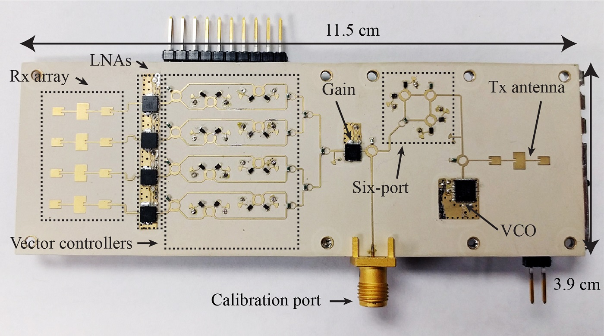
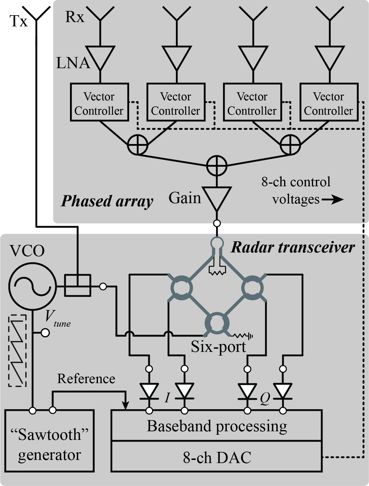
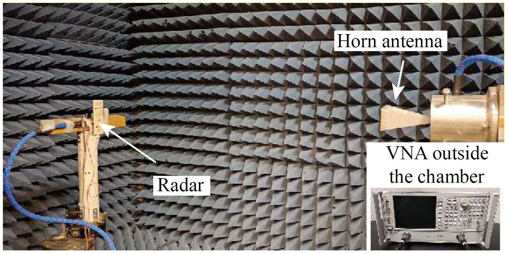
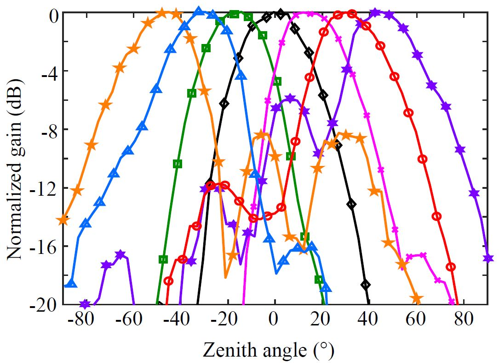
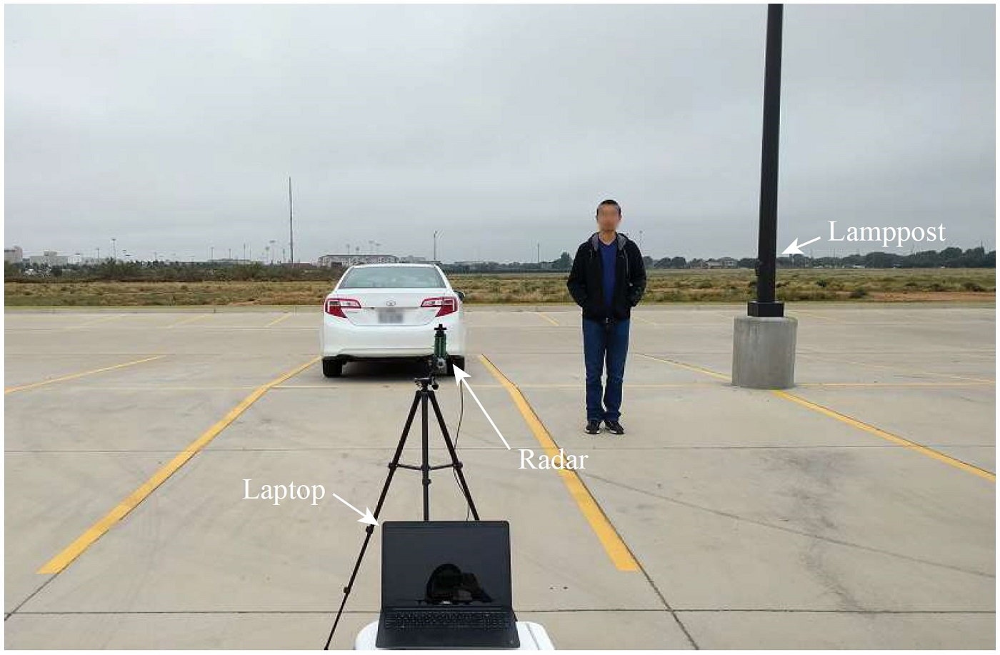
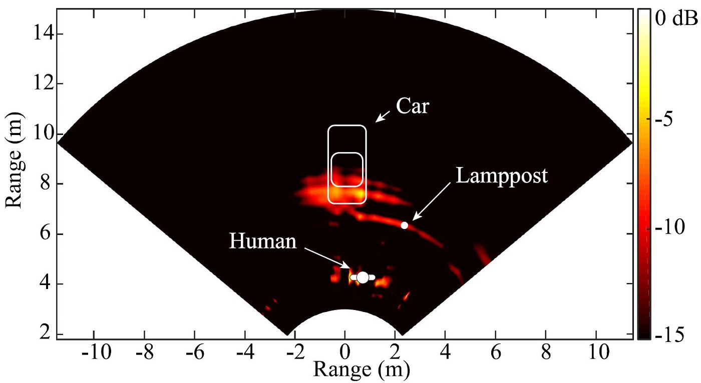
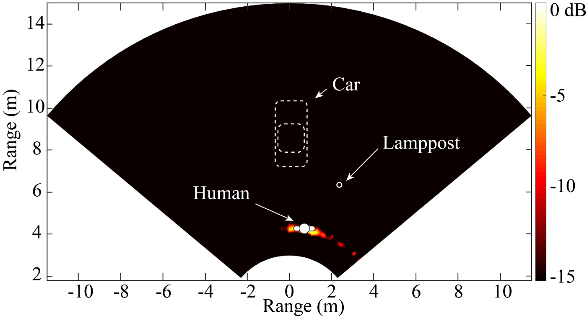

  

    

      
A portable 24-GHz FMCW radar that can steer its receive beam anywhere within <strong>±45°</strong>. It was the first short-range localization radar in K-band to do this beamforming entirely on a printed circuit board. Instead of phase-shifter chips or bulky modules, each antenna element's phase and amplitude are set by a <strong>vector controller</strong> made from simple microwave structures and PIN diodes.

      
Building a K-band system on a PCB brings errors from component variation, mismatch, soldering, and fabrication, so I also developed a calibration method and showed in experiments that it works. Because the vector controllers set amplitude as well as phase, the same hardware can form more complex beam patterns too.

      
Ph.D. researchTexas Tech University2017

    

    <dl class="rp-facts">
      
<dt>Frequency sweep</dt><dd>23.5–24 GHz FMCW</dd>

      
<dt>Receive array</dt><dd>4 elements, each a series-fed patch array</dd>

      
<dt>Beam steering</dt><dd>Continuous, ±45° in the H-plane</dd>

      
<dt>Size and weight</dt><dd>11.5 × 3.9 cm, 69 g</dd>

      
<dt>Power</dt><dd>A single 9-V battery</dd>

    </dl>
  

  <figure class="rp-monitor">
    
    <figcaption><b>Fig. 1</b>The 24-GHz phased-array radar prototype</figcaption>
  </figure>
  

    
<b>±45°</b>continuous beam steering

    
<b>500 MHz</b>FMCW sweep bandwidth

    
<b>69 g</b>total weight

    
<b>9 V</b>runs on one battery

  

  <section>
    <h2>System Design</h2>
    
Beamforming with PIN diodes and microstrip

    

      

        <h3>Transmitter</h3>
        
A VCO feeds a single patch antenna. A sawtooth voltage from an op-amp circuit tunes the VCO, sweeping its output from 23.5 to 24 GHz.

        <h3>Receiver</h3>
        
The receive side is a four-element linear array, where each element is itself a series-fed microstrip patch array. Each element feeds a <strong>vector controller</strong>, which works by adding signal vectors to set the phase and amplitude of that element. Steering the beam then comes down to choosing the four settings, and the beam can point anywhere within ±45° in the H-plane.

        
Earlier vector-sum designs relied on integrated circuits or bulky modules. Here the whole controller is built from microwave structures and PIN diodes on the PCB. A six-port circuit detects the FMCW beat signal, and a laptop sound card samples it.

      

      <figure class="rp-fig"><figcaption><b>Fig. 2</b>Block diagram of the 24-GHz phased-array radar</figcaption></figure>
    

  </section>
  <section>
    <h2>Hardware</h2>
    
Bill of materials

    

      
The whole radar is built on PCBs (Fig. 1): the RF board on Rogers RO3006 and the baseband board on FR4. The main parts are listed below.

    

    

      <table class="rp-table">
        <thead><tr><th>Block</th><th>Function</th><th>Part</th></tr></thead>
        <tbody>
          <tr><th rowspan="2">Beamforming array</th><td>LNA</td><td>MACOM <code>MAAL-011111</code></td></tr>
          <tr><td>PIN diode</td><td>Skyworks <code>SMP1302</code></td></tr>
          <tr><th rowspan="3">FMCW transceiver</th><td>VCO</td><td>Analog Devices <code>HMC739LP4</code></td></tr>
          <tr><td>Gain block</td><td>MACOM <code>MAAL-011111</code></td></tr>
          <tr><td>Schottky diode</td><td>Skyworks <code>SMS7621-040LF</code></td></tr>
          <tr><th rowspan="2">Baseband</th><td>Op amp</td><td>Analog Devices <code>ADA4851</code></td></tr>
          <tr><td>DAC</td><td>Analog Devices <code>AD5668</code></td></tr>
        </tbody>
      </table>
    

  </section>
  <section>
    <h2>Experiments</h2>
    
Steering, mapping, finding people

    

      

        <h3>Beam patterns in the anechoic chamber</h3>
        
I measured the far-field pattern of the array in an anechoic chamber (Fig. 3) while the vector controllers stepped the beam from −45° to 45° in 15° steps. Fig. 4 shows the measured patterns at each angle.

        

          <figure class="rp-fig"><figcaption><b>Fig. 3</b>Testing in the microwave anechoic chamber</figcaption></figure>
          <figure class="rp-fig"><figcaption><b>Fig. 4</b>Measured patterns steered to −45°, −30°, −15°, 0°, 15°, 30°, and 45°</figcaption></figure>
        

      

      

        <h3>Mapping a scene outdoors</h3>
        
In the field test (Fig. 5), a car, a lamppost, and a person stood in front of the radar, which ran from a single 9-V battery. The radar swept its beam from −45° to 45° in 2.5° steps, taking an FMCW measurement at each angle.

        
The resulting map (Fig. 6) clearly shows all three targets. The person's signature, however, flickers from scan to scan, because breathing and small body movements keep changing the echo. This is the vital-Doppler effect.

        

          <figure class="rp-fig"><figcaption><b>Fig. 5</b>The field test setup</figcaption></figure>
          <figure class="rp-fig"><figcaption><b>Fig. 6</b>The measured map of the scene</figcaption></figure>
        

      

      

        <h3>Telling people apart from objects</h3>
        

          

            
That flicker is useful. I ran 10 scans in a row and took the standard deviation of the range spectrum at each point. The car and the lamppost do not change, so they drop out. The person changes all the time, so they remain (Fig. 7).

            
The result is <strong>human-aware localization</strong>: the radar can tell where people are, even when they stand still among other objects.

          

          <figure class="rp-fig"><figcaption><b>Fig. 7</b>Only the person remains after suppressing stationary targets</figcaption></figure>
        

      

    

  </section>
  <section>
    <h2>Publication</h2>
    
Where this work appeared

    <ol class="rp-pubs">
      <li><a href="http://ieeexplore.ieee.org/document/7858751">A κ-band portable FMCW radar with beamforming array for short-range localization and vital-Doppler targets discrimination</a><strong>Z. Peng</strong>, L. Ran, and C. LiJournal<em>IEEE Transactions on Microwave Theory and Techniques</em>, vol. 65, no. 9, pp. 3443–3452, Sep. 2017</li>
    </ol>
  </section>
  

    Part of my Ph.D. research at Texas Tech University
    <a href="/research-projects/">All research projects</a> · <a href="/publications/">Publications</a>
  

