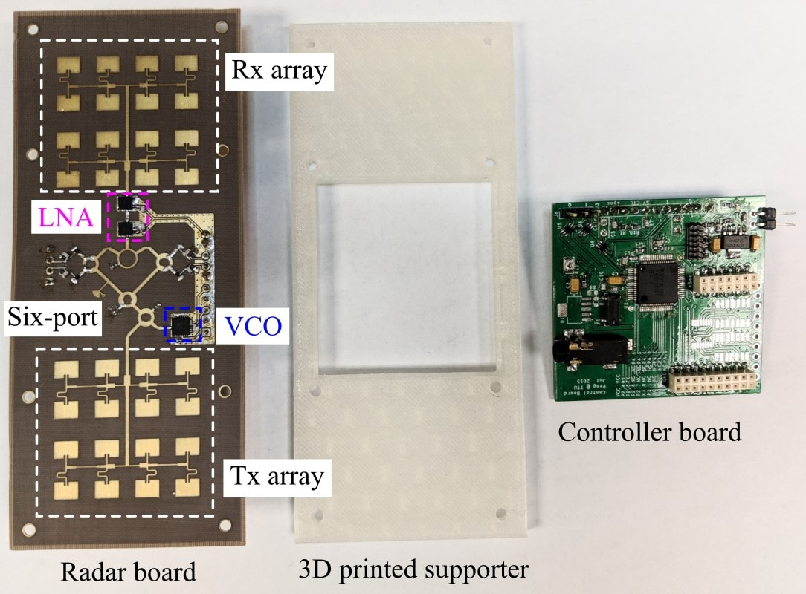
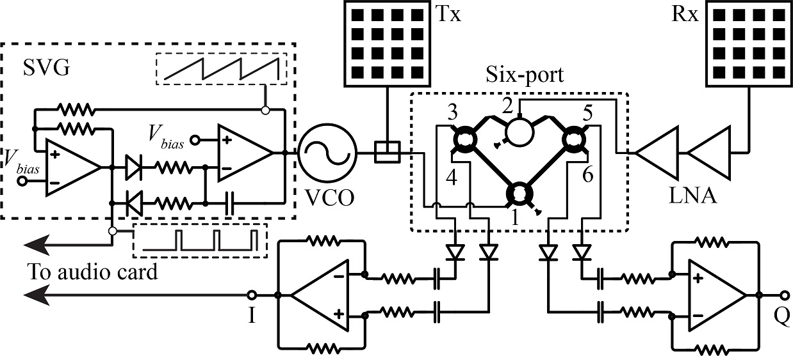
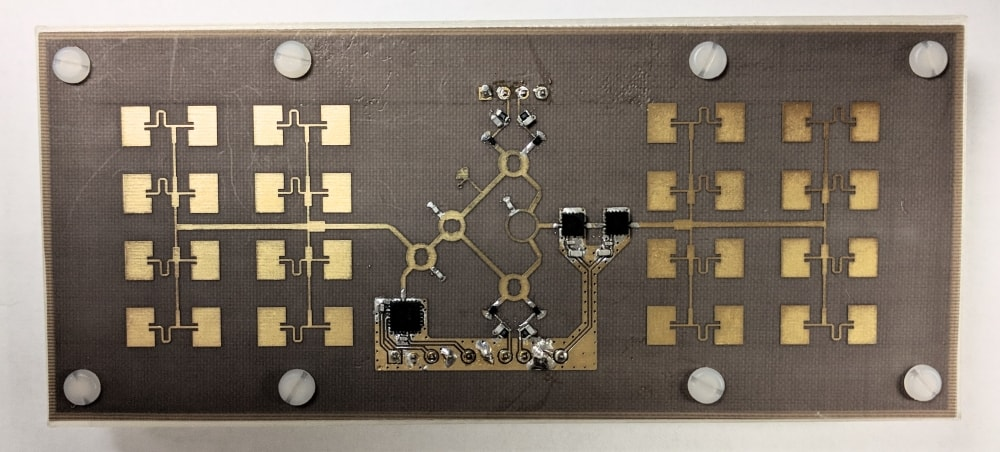
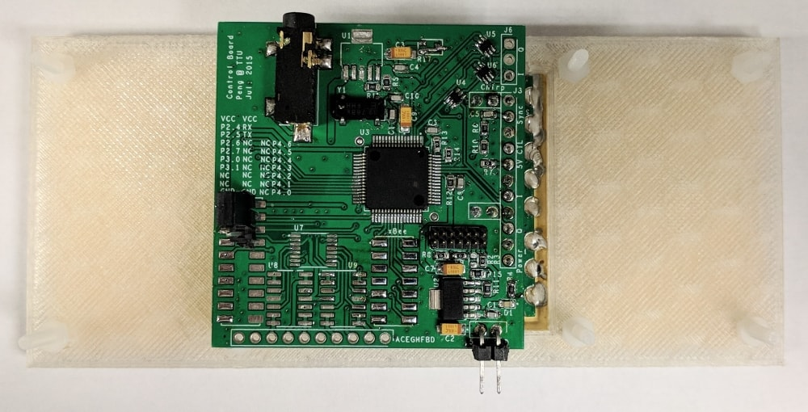
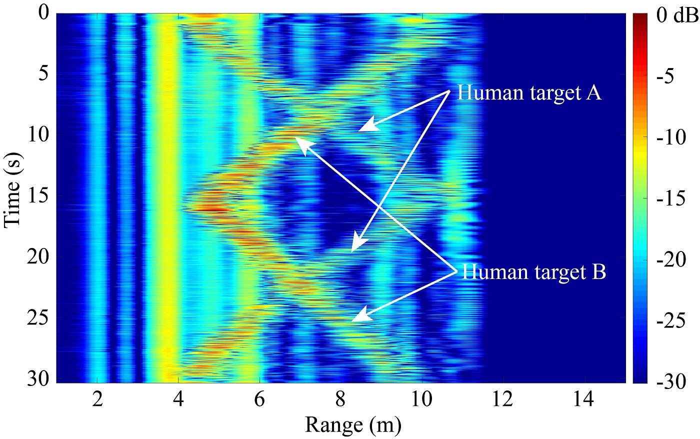
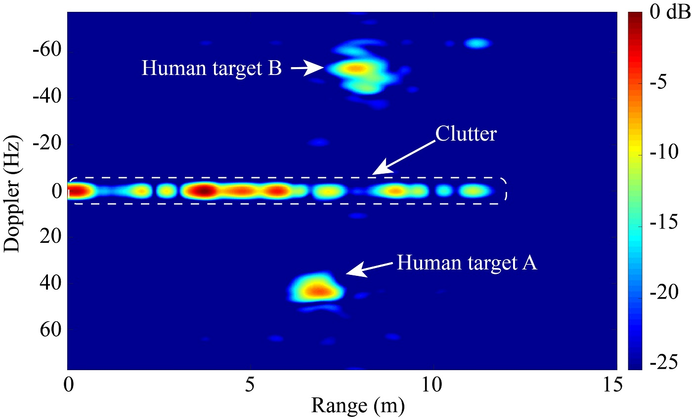
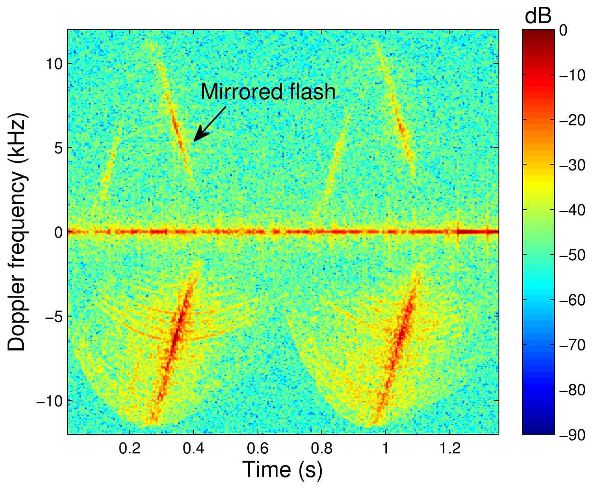
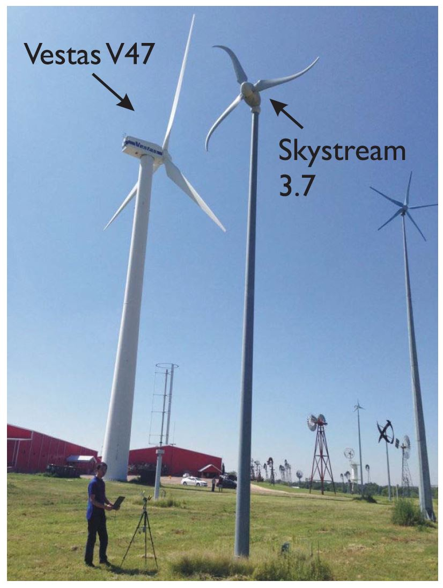
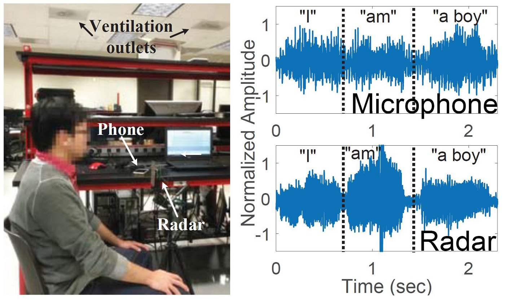

  

    

      
A portable 24-GHz radar that works in two modes. In <strong>FMCW</strong> mode it measures range to track moving people. In <strong>interferometry</strong> mode it holds a single frequency to sense small motions such as vital signs. An on-board microcontroller switches between the two modes, which share the same RF parts and signal paths.

      
Moving to 24 GHz shrinks the antennas and makes the radar more sensitive to small motions than its <a href="/2017/01/28/c-band-portable-multi-mode-radar/">5.8-GHz sibling</a>. The RF board is built on a thin, flexible substrate. I used the radar to track people, make range-Doppler images, monitor wind turbines, and sense speech from vocal-fold vibration; it was also used for SAR imaging from an unmanned aerial vehicle.

      
Ph.D. researchTexas Tech University2015–2017

    

    <dl class="rp-facts">
      
<dt>Frequency</dt><dd>24 GHz (K-band)</dd>

      
<dt>Modes</dt><dd>FMCW and interferometry, on one RF chain</dd>

      
<dt>RF board</dt><dd>Flexible Rogers RT/duroid 5880, 0.245 mm thick</dd>

      
<dt>Size</dt><dd>118 × 45 × 15 mm</dd>

      
<dt>Data capture</dt><dd>A laptop sound card</dd>

    </dl>
  

  <figure class="rp-monitor">
    
    <figcaption><b>Fig. 1</b>The K-band portable multi-mode radar prototype</figcaption>
  </figure>
  

    
<b>24 GHz</b>carrier frequency

    
<b>2</b>radar modes, one RF chain

    
<b>0.245 mm</b>flexible RF substrate

    
<b>118 mm</b>long, 45 mm wide, 15 mm thick

  

  <section>
    <h2>Design</h2>
    
Two modes, one set of hardware

    <figure class="rp-fig">
      
      <figcaption><b>Fig. 2</b>Block diagram of the 24-GHz flexible multi-mode radar prototype</figcaption>
    </figure>
    

      
The architecture (Fig. 2) follows the same idea as the C-band radar: to keep the system simple and cheap, the FMCW and interferometry modes share the same RF components and signal paths, and a laptop sound card samples the baseband signal.

      <ul class="rp-list">
        <li><strong>Interferometry mode</strong> runs at a single 24-GHz carrier. Vital signs are so slow that a sound card would filter them out, so a <strong>low-IF modulation</strong> shifts the baseband signal up to an intermediate frequency before sampling.</li>
        <li><strong>FMCW mode</strong> sweeps a free-running VCO with a sawtooth from a simple op-amp circuit. A <strong>reference pulse sequence</strong>, locked to the sawtooth, is recorded alongside the beat signal so that every chirp can be aligned, which keeps the measurements coherent.</li>
      </ul>
    

  </section>
  <section>
    <h2>Hardware</h2>
    
Flexible RF board, rigid baseband board

    

      
The RF board (Fig. 1) is built on Rogers RT/duroid 5880 only 0.245 mm thick, so it can bend. The baseband board is a rigid FR4 PCB. Assembled, the radar measures 118 × 45 × 15 mm (Figs. 3 and 4).

    

    

      <figure class="rp-fig"><figcaption><b>Fig. 3</b>The assembled radar, top</figcaption></figure>
      <figure class="rp-fig"><figcaption><b>Fig. 4</b>The assembled radar, bottom</figcaption></figure>
    

  </section>
  <section>
    <h2>Experiments</h2>
    
What the radar can do

    

      

        <h3>Tracking two people</h3>
        
Two people walked in front of the radar in the same corridor. Person A walked away from the radar and back, while person B walked toward it and away again. Both paths are visible in the range profiles (Fig. 5), along with returns from stationary clutter.

        
Adding Doppler turns the range profiles into a range-Doppler video. In the frame in Fig. 6, A is walking away and B is walking toward the radar, so the two show up at opposite Doppler frequencies.

        

          <figure class="rp-fig"><figcaption><b>Fig. 5</b>Range profiles of two people walking in opposite directions</figcaption></figure>
          <figure class="rp-fig"><figcaption><b>Fig. 6</b>One frame of the range-Doppler video</figcaption></figure>
        

      

      

        <h3>Monitoring wind turbines</h3>
        

          

            
At the American Wind Power Center in Lubbock, Texas, which has turbines of many sizes and designs, I aimed the radar at a Vestas V47 (Fig. 7) and recorded its micro-Doppler signature. Fig. 8 shows the spectrogram. Signatures like this can be used to monitor the structural health of the turbine.

            <figure class="rp-fig"><figcaption><b>Fig. 8</b>Spectrogram of the Vestas V47 wind turbine</figcaption></figure>
          

          <figure class="rp-fig rp-narrow"><figcaption><b>Fig. 7</b>Measuring at the American Wind Power Center, Lubbock, TX</figcaption></figure>
        

      

      

        <h3>Hearing speech without a microphone</h3>
        

          

            
When we speak, our vocal folds vibrate. Aimed at a speaker's throat (Fig. 9), the radar picks up these vibrations directly, so it captures speech without relying on sound traveling through the air.

            
Because it does not hear background noise, this “auditory radar” could help with robust speech recognition, speech recovery, and surveillance.

          

          <figure class="rp-fig"><figcaption><b>Fig. 9</b>Experimental setup of the auditory radar</figcaption></figure>
        

      

    

  </section>
  <section>
    <h2>Publications</h2>
    
Where this work appeared

    <ol class="rp-pubs">
      <li><a href="http://www.mdpi.com/1424-8220/16/8/1181/htm">Time-varying vocal folds vibration detection using a 24 GHz portable auditory radar</a>H. Hong, H. Zhao, <strong>Z. Peng</strong>, H. Li, C. Gu, C. Li, and X. ZhuJournal<em>Sensors</em>, vol. 16, no. 8, article 1181, Aug. 2016</li>
      <li><a href="http://ieeexplore.ieee.org/document/7487021">Short-range Doppler-radar signatures from industrial wind turbines: theory, simulations, and measurements</a>J.-M. Muñoz-Ferreras, <strong>Z. Peng</strong>, Y. Tang, R. Gómez-García, D. Liang, and C. LiJournal<em>IEEE Transactions on Instrumentation and Measurement</em>, vol. 65, no. 9, pp. 2108–2119, Sep. 2016</li>
      <li><a href="http://ieeexplore.ieee.org/document/7540011">A portable 24-GHz auditory radar for non-contact speech sensing with background noise rejection and directional discrimination</a>H. Zhao, <strong>Z. Peng</strong>, H. Hong, X. Zhu, and C. LiConference<em>IEEE International Microwave Symposium (IMS)</em>, San Francisco, CA, May 2016</li>
      <li><a href="http://ieeexplore.ieee.org/document/7585400">24-GHz biomedical radar on flexible substrate for ISAR imaging</a><strong>Z. Peng</strong>, J.-M. Muñoz-Ferreras, R. Gómez-García, L. Ran, and C. LiConference<em>IEEE International Wireless Symposium (IWS)</em>, Shanghai, China, Mar. 2016</li>
      <li><a href="http://ieeexplore.ieee.org/document/7303787">A portable 24-GHz FMCW radar based on six-port for indoor human tracking</a><strong>Z. Peng</strong> and C. LiConference<em>IEEE MTT-S International Microwave Workshop Series on RF and Wireless Technologies for Biomedical and Healthcare Applications (IMWS-BIO)</em>, Taipei, Taiwan, Sep. 2015</li>
    </ol>
  </section>
  

    Part of my Ph.D. research at Texas Tech University
    <a href="/research-projects/">All research projects</a> · <a href="/publications/">Publications</a>
  

