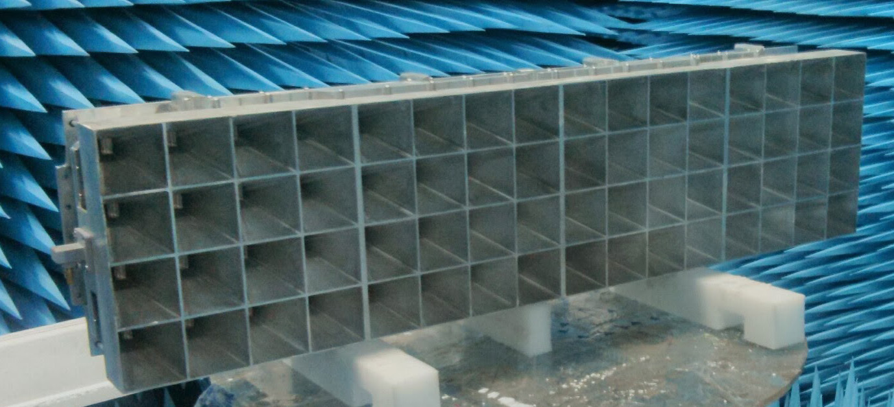
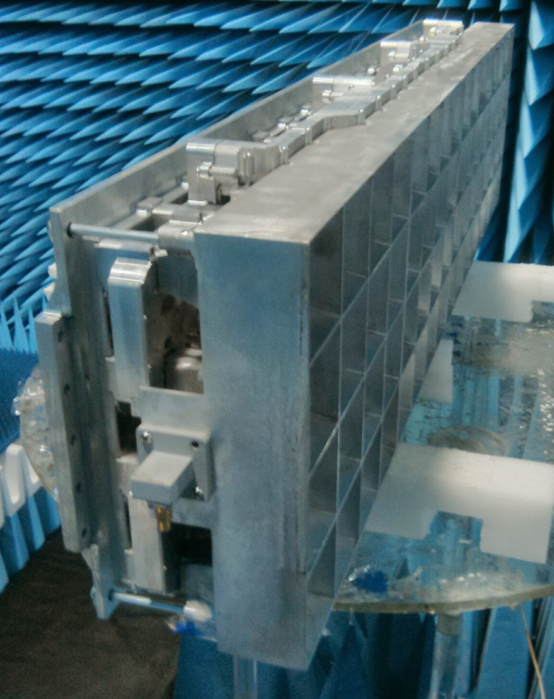

# Introduction

In this work, a 16 x 4 quadrature polarized horn array was designed for satellite communication. This array has 12.5 GHz and 14.25 GHz bands, each band has 500 MHz bandwidth.

# Design

This array and its feeding network were designed with CST Microwave Studio. Some parts of this design can be found on my [GitHub](https://github.com/rookiepeng) page.

  
**Fig. 1. Front view of the array**

  
**Fig. 2. Side view of the array**
