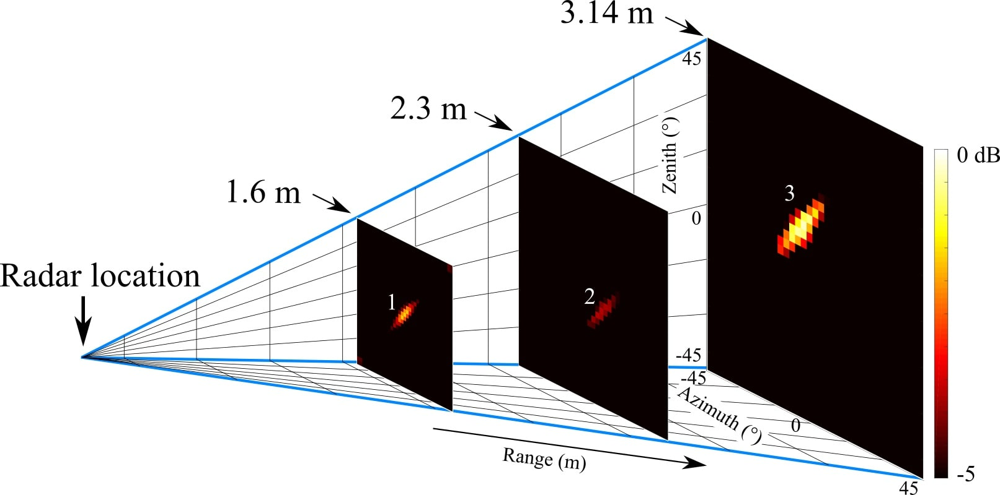
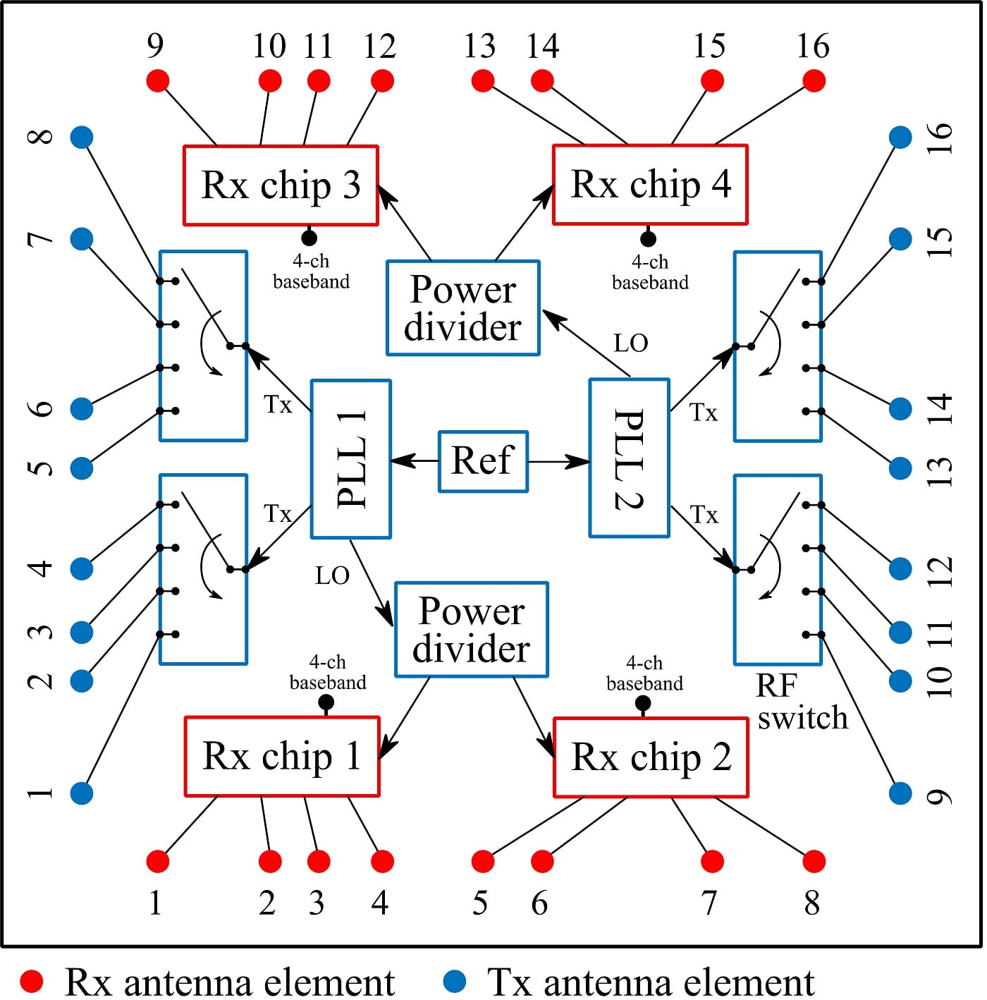
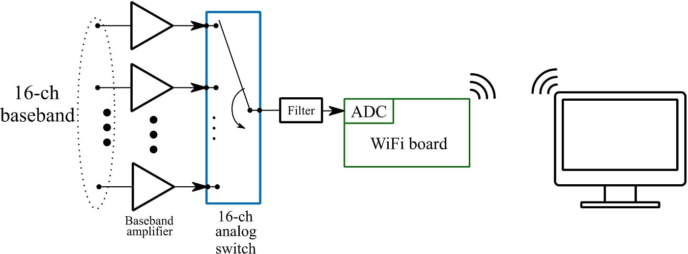
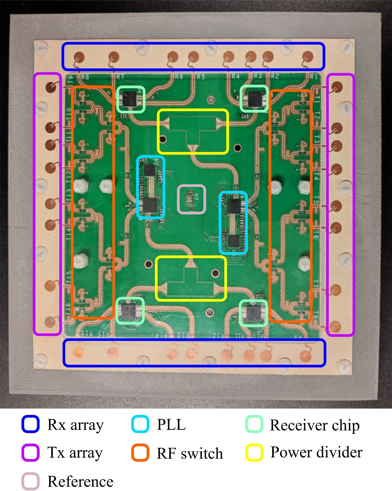
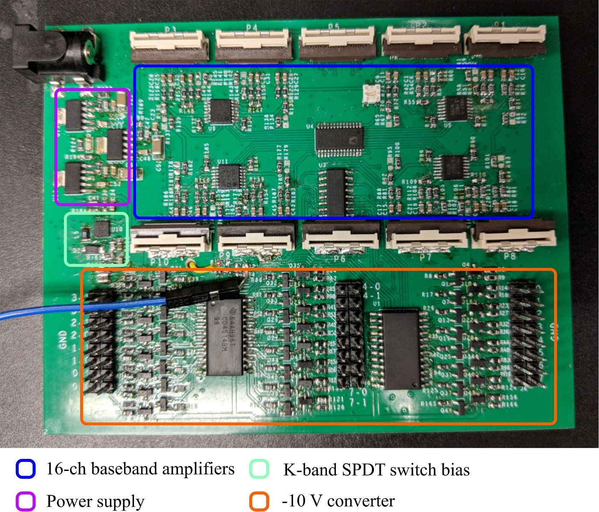
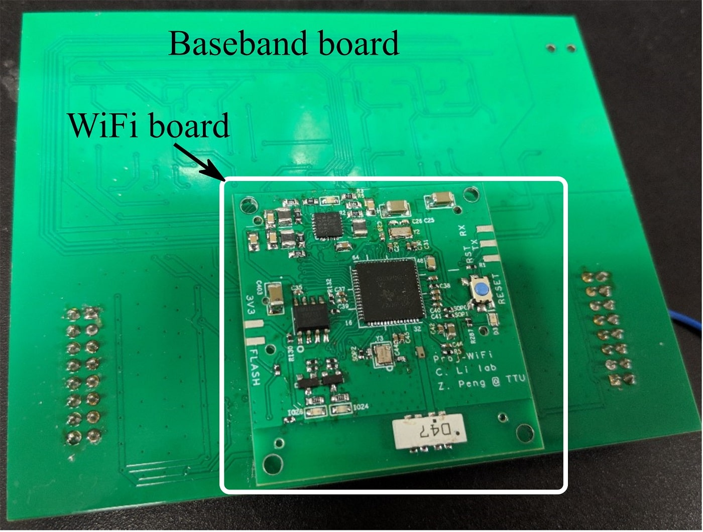
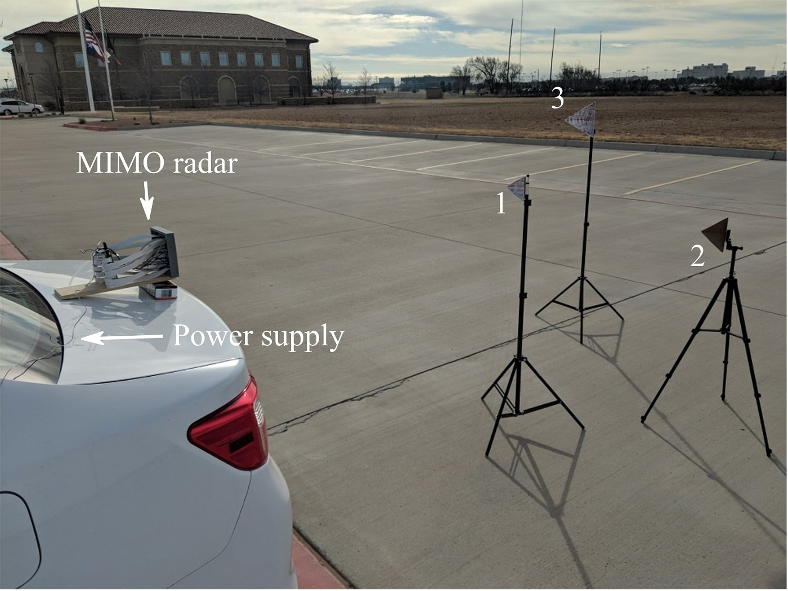

  

    

      
A portable K-band FMCW radar that locates targets in three dimensions: range, azimuth, and elevation. It uses <strong>MIMO</strong>, where every transmitter–receiver pair acts as one element of a much larger virtual array, so a modest number of channels gives the angular resolution of a far bigger antenna.

      
Spreading antennas far apart usually creates grating lobes, false beams pointing in the wrong direction. This radar avoids them with a <strong>non-uniformly spaced array</strong> whose element positions and weights I optimized. A calibration procedure aligns the phase and amplitude of every virtual element. The full design and signal processing are described in my Ph.D. dissertation.

      
Ph.D. dissertationTexas Tech University2017

    

    <dl class="rp-facts">
      
<dt>Frequency</dt><dd>24 GHz (K-band) FMCW</dd>

      
<dt>Antennas</dt><dd>16 Tx and 16 Rx, non-uniformly spaced around a square</dd>

      
<dt>Design resolution</dt><dd>3° in azimuth and elevation</dd>

      
<dt>Field of view</dt><dd>90° horizontal and vertical</dd>

      
<dt>Data link</dt><dd>Wi-Fi to a laptop</dd>

    </dl>
  

  <figure class="rp-monitor">
    
    <figcaption><b>Fig. 1</b>Three corner reflectors located in 3D by the radar prototype</figcaption>
  </figure>
  

    
<b>16 + 16</b>Tx and Rx antennas

    
<b>3°</b>designed angular resolution

    
<b>90°</b>field of view, both planes

    
<b>120 mm</b>square RF board

  

  <section>
    <h2>System Design</h2>
    
RF board · baseband board · Wi-Fi board

    

      

        <h3>RF board</h3>
        
On the transmit side, two PLLs share one reference clock. Each PLL has an LO output and two Tx outputs, all switched on and off independently. Every Tx output drives a custom single-pole-four-throw (SP4T) switch that selects one of four transmit antennas, so 4 Tx outputs reach all 16 transmit antennas.

        
On the receive side, four radar receiver chips with four channels each provide 16 receive channels. Two of the chips take their LO from PLL 1 and the other two from PLL 2.

        
The 16 transmit and 16 receive antennas sit along the edges of a square (Fig. 2). Their unequal spacing narrows the beam while keeping grating lobes away, giving a designed resolution of 3° over a 90° field of view in both planes.

      

      <figure class="rp-fig"><figcaption><b>Fig. 2</b>Block diagram of the RF board</figcaption></figure>
    

    <figure class="rp-fig"><figcaption><b>Fig. 3</b>Block diagram of the baseband part</figcaption></figure>
    

      <h3>Baseband and Wi-Fi</h3>
      
Sixteen baseband amplifiers condition the 16 receive channels (Fig. 3). An analog switch then picks one channel at a time for the ADC on a Wi-Fi board, which sends the samples to a computer for processing. The microcontroller on that Wi-Fi board also controls everything else on the RF and baseband boards.

    

  </section>
  <section>
    <h2>Prototype</h2>
    
RF, baseband, and Wi-Fi boards

    

      

        
The RF board (Fig. 4) follows the layout in Fig. 2. It is built on 0.254-mm Rogers RO3003, measures 120 × 120 mm, and sits on a 3D-printed frame.

        
The front of the baseband board (Fig. 5) holds the power supply, the 16 baseband amplifiers, bias circuits for the K-band switches, and a −10 V converter. The Wi-Fi board is stacked on the back (Fig. 6). Its main chip, a TI CC3200, combines an ARM microcontroller, a Wi-Fi subsystem, and an ADC that samples at up to 250 ksps.

      

      <figure class="rp-fig rp-narrow"><figcaption><b>Fig. 4</b>The RF board</figcaption></figure>
    

    

      <figure class="rp-fig"><figcaption><b>Fig. 5</b>The baseband board, front</figcaption></figure>
      <figure class="rp-fig"><figcaption><b>Fig. 6</b>The back of the baseband board, with the Wi-Fi board stacked on it</figcaption></figure>
    

    

      <table class="rp-table">
        <thead><tr><th>Board</th><th>Function</th><th>Part</th><th>Manufacturer</th></tr></thead>
        <tbody>
          <tr><th rowspan="5">RF board</th><td>Clock</td><td><code>520L15IA40M0000</code></td><td>CTS</td></tr>
          <tr><td>PLL</td><td><code>ADF4159</code></td><td>Analog Devices</td></tr>
          <tr><td>VCO</td><td><code>ADF5901</code></td><td>Analog Devices</td></tr>
          <tr><td>Receiver</td><td><code>ADF5904</code></td><td>Analog Devices</td></tr>
          <tr><td>PIN diode</td><td><code>MADP-000907-14020W</code></td><td>MACOM</td></tr>
          <tr><th rowspan="6">Baseband board</th><td>Regulator</td><td><code>TPS7A4501DCQR</code></td><td>Texas Instruments</td></tr>
          <tr><td>DC-DC converter</td><td><code>TPS63700</code></td><td>Texas Instruments</td></tr>
          <tr><td>Decoder</td><td><code>CD74AC138</code></td><td>Texas Instruments</td></tr>
          <tr><td>Decoder</td><td><code>CD4514B</code></td><td>Texas Instruments</td></tr>
          <tr><td>Op amp</td><td><code>ADA4851</code></td><td>Analog Devices</td></tr>
          <tr><td>Analog switch</td><td><code>ADG706</code></td><td>Analog Devices</td></tr>
          <tr><th rowspan="5">Wi-Fi board</th><td>Wi-Fi and ARM MCU</td><td><code>CC3200</code></td><td>Texas Instruments</td></tr>
          <tr><td>Filter</td><td><code>DEA162450BT</code></td><td>TDK</td></tr>
          <tr><td>Antenna</td><td><code>AH104F</code></td><td>Taiyo Yuden</td></tr>
          <tr><td>DC-DC converter</td><td><code>ADP5135</code></td><td>Analog Devices</td></tr>
          <tr><td>Flash</td><td><code>AT25SF161</code></td><td>Adesto</td></tr>
        </tbody>
      </table>
    

  </section>
  <section>
    <h2>Experiment</h2>
    
Three corner reflectors in 3D

    

      <h3>Locating targets in range, azimuth, and elevation</h3>
      

        

          
I tested the radar in an open area to avoid multipath. The radar sat on a car, powered from the cigarette lighter, and a laptop inside the car recorded its data over Wi-Fi. Three corner reflectors stood in front of it at different ranges and heights (Fig. 7).

          
In this prototype, 8 of the 16 transmit antennas and 8 of the 16 receive antennas were working, which gives 64 transmit–receive channels. That was enough for 3D imaging. After calibration, the radar placed the three reflectors at <strong>1.6 m, 2.3 m, and 3.14 m</strong>, each at its own azimuth and elevation (Fig. 1).

        

        <figure class="rp-fig"><figcaption><b>Fig. 7</b>The experiment setup</figcaption></figure>
      

    

  </section>
  <section>
    <h2>Publication</h2>
    
Where this work appeared

    <ol class="rp-pubs">
      <li><a href="https://ieeexplore.ieee.org/document/8474363">A portable K-band 3-D MIMO radar with nonuniformly spaced array for short-range localization</a><strong>Z. Peng</strong> and C. LiJournal<em>IEEE Transactions on Microwave Theory and Techniques</em>, vol. 66, no. 11, pp. 5075–5086, Nov. 2018</li>
    </ol>
  </section>
  

    Part of my Ph.D. research at Texas Tech University
    <a href="/research-projects/">All research projects</a> · <a href="/publications/">Publications</a>
  

