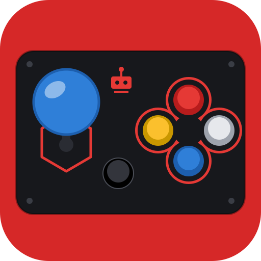
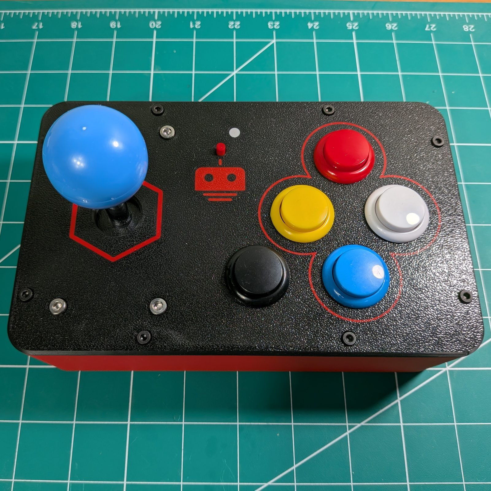
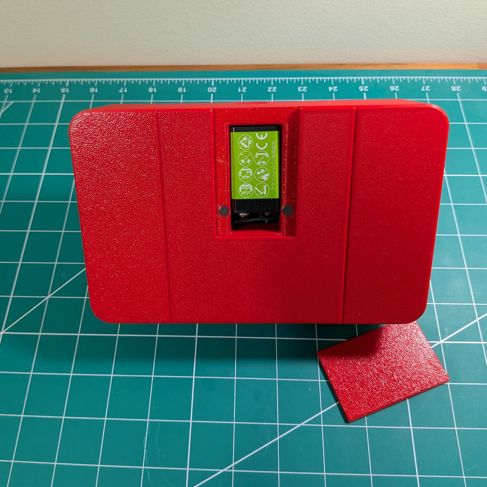
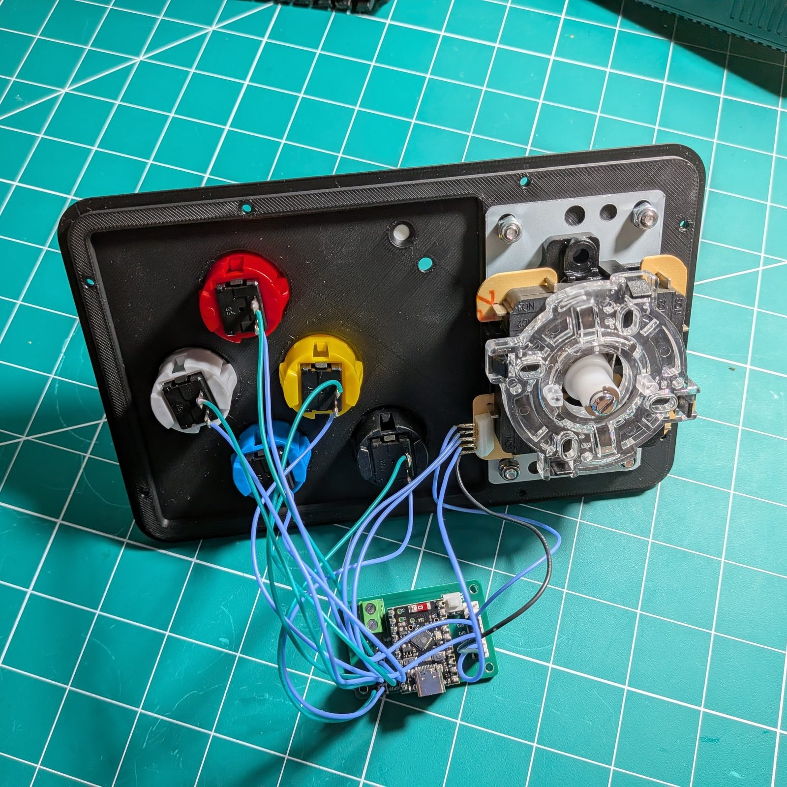

<!-- =====================================================================
  Arcade Remote project page (repo: rookidroid/remote-arcade).
  All classes are prefixed "arc-"; colours come from the site palette in
  src/styles/theme.css. Keep this block free of blank lines, or Markdown
  takes over part way through.
====================================================================== -->

  <!-- Intro -->
  

    
    

      
The Arcade Remote turns real arcade hardware into a WiFi controller for robots: a microswitch joystick, five snap-in arcade buttons, and an ESP32-C6, all in a 3D-printed cabinet that fits in your hands. It drives every <a href="/2024/09/12/hexapod/">RookiDroid hexapod</a>, and any other robot that speaks the same UDP protocol.

      

        <a class="arc-btn arc-btn-primary" href="https://rookidroid.com/build-the-arcade-remote/">Build guide <small>rookidroid.com</small></a>
        <a class="arc-btn arc-btn-dark" href="https://github.com/rookidroid/remote-arcade">Source on GitHub</a>
        <a class="arc-btn arc-btn-ghost" href="https://rookidroid.com/product/arcade-controller/">3D print files <small>free</small></a>
      

    

  

  <!-- Photos -->
  <section>
    

      <figure><figcaption>Top panel · joystick, direction cluster, special button</figcaption></figure>
      <figure><figcaption>Back · magnetic battery bay with a 9 V battery</figcaption></figure>
    

    

      
<b>9</b>microswitches

      
<b>5 ms</b>input scan

      
<b>20 Hz</b>heartbeat to the robot

      
<b>5</b>speed levels

    

  </section>
  <!-- Overview -->
  <section>
    

      <h2>Overview</h2>
      
An arcade stick for a six-legged robot

      
Each RookiDroid hexapod (Nougat, Mochi and Macaroon) hosts its own WiFi access point and listens for UDP commands. The Arcade Remote joins that access point directly, with no router in between, and sends the robot one command at a time, built from whatever the joystick and buttons are doing. Switching robots means changing a single line in the sketch.

      <ul>
        <li><strong>Real arcade feel:</strong> a microswitch joystick and five snap-in arcade buttons. No analog sticks and no deadzone.</li>
        <li><strong>All-digital inputs:</strong> nine switches on <code>INPUT_PULLUP</code> GPIOs, scanned every 5 ms. A command has to hold for 30 ms before it is sent, which filters switch bounce and half-pressed combos.</li>
        <li><strong>Stops when you let go:</strong> a new command goes out as soon as it settles, and the current one repeats every 50 ms, so releasing the controls stops the robot right away.</li>
        <li><strong>Adjustable speed:</strong> five levels from 20 % to 100 % of the robot's gait speed, remembered across power cycles.</li>
        <li><strong>Battery powered:</strong> a single 9 V battery in a bay closed by a magnetic cover, no screws.</li>
      </ul>
    

  </section>
  <!-- Hardware -->
  <section>
    <h2>Hardware</h2>
    
ESP32-C6 · arcade parts · one print project

    

      <figure>
        
        <figcaption>Under the panel: one wire per button, plus the joystick harness</figcaption>
      </figure>
      

        
<strong>Controller board<em>×1</em></strong>ESP32-C6 SuperMini on a carrier board with a Mini360 buck converter (9 V to 5 V), a power switch, a battery terminal, a 5-pin joystick header and a 2×7 button header. <a href="https://rookidroid.com/product/arcade-controller-board/">Available here</a>, or wire the switches straight to a bare SuperMini.

        
<strong>Arcade joystick<em>×1</em></strong>Microswitch stick with a ball top and a 5-pin harness. Fit the 8-way gate if you want diagonals.

        
<strong>Arcade push buttons<em>×5</em></strong>30 mm snap-in buttons with microswitches: four for the direction cluster and one for the special (modifier) button.

        
<strong>Power<em>9 V</em></strong>A 9 V battery and a snap connector screwed into the terminal block, with four 6 × 2 mm magnets to hold the battery cover.

        
<strong>Cabinet<em>PLA</em></strong>Body, top cover, bottom plate and battery cover, all in one Bambu Studio project, plus the Fusion 360 source. The cover is multi-material, so the logo and outlines print in a second color.

      

    

    

      <table class="arc-table">
        <thead><tr><th>Input</th><th>Signal</th><th>GPIO</th><th>Header</th></tr></thead>
        <tbody>
          <tr><th>Joystick up / down / left / right</th><td><code>JS_UP</code> <code>JS_DOWN</code> <code>JS_LEFT</code> <code>JS_RIGHT</code></td><td><code>GP3</code> <code>GP2</code> <code>GP0</code> <code>GP1</code></td><td>5-pin joystick</td></tr>
          <tr><th>Buttons up / down / left / right</th><td><code>BT_UP</code> <code>BT_DOWN</code> <code>BT_LEFT</code> <code>BT_RIGHT</code></td><td><code>GP14</code> <code>GP15</code> <code>GP18</code> <code>GP19</code></td><td>2×7 button</td></tr>
          <tr><th>Special button</th><td><code>BT_SPECIAL</code></td><td><code>GP20</code></td><td>2×7 button</td></tr>
          <tr><th>Status LED</th><td><code>PIN_RGB</code></td><td><code>GP8</code></td><td>WS2812 on the SuperMini</td></tr>
        </tbody>
      </table>
    

    
Every input is a plain switch to ground: the firmware enables the internal pull-ups, so one terminal goes to the signal pin and the other to any <code>GND</code> pin.

  </section>
  <!-- Controls -->
  <section>
    <h2>Controls</h2>
    
One command at a time · nothing pressed means stand by

    

      

        <h3>Joystick</h3>
        
Walks in eight directions, and takes priority over the direction buttons.

        <dl>
          <dt>Up / Down</dt><dd>Walk forward / backward</dd>
          <dt>Left / Right</dt><dd>Sidestep left / right</dd>
          <dt>Diagonals</dt><dd>Walk at 45° and 135° either side</dd>
        </dl>
      

      

        <h3>Direction buttons</h3>
        
Used when the joystick is centered.

        <dl>
          <dt>Up</dt><dd>Walk forward</dd>
          <dt>Down</dt><dd>Walk backward</dd>
          <dt>Left</dt><dd>Turn left in place</dd>
          <dt>Right</dt><dd>Turn right in place</dd>
        </dl>
      

      

        <h3>Special + button</h3>
        
Holding special turns the cluster into body motion.

        <dl>
          <dt>+ Up</dt><dd>Body pitch</dd>
          <dt>+ Left</dt><dd>Body roll</dd>
          <dt>+ Right</dt><dd>Body yaw</dd>
          <dt>+ Down</dt><dd>Body twist</dd>
        </dl>
      

    

    

      
<strong>Turbo</strong>Hold the up button while pushing the joystick up to run forward fast, or the down button while pulling it down to run backward fast.

      
<strong>Speed</strong>Hold special and flick the joystick up or down to step between 20, 40, 60, 80 and 100 %. The level is saved in flash and sent with every packet, so the robot always follows the remote.

      
<strong>Forgiving combos</strong>Because a command must hold for 30 ms, special + up doesn't have to be pressed perfectly together: the robot gets the finished combo, not whichever switch closed first.

    

    

      
<i class="arc-blink" style="--c:#3d7bff"></i><b>Blinking blue</b>Connecting to the robot

      
<i class="arc-blink" style="--c:#ff3b3b"></i><b>Blinking red</b>WiFi lost, retrying

      
<i style="--c:#2ee86a"></i><b>Green</b>Connected, standing by

      
<i style="--c:#2fe3f0"></i><b>Cyan</b>Walking or turning

      
<i style="--c:#ffd23f"></i><b>Yellow</b>Turbo

      
<i style="--c:#ff4bd8"></i><b>Magenta</b>Body motion

      
<i style="--c:#ffffff"></i><b>White flash</b>Speed level changed

      
<i style="--c:#7f8eab;box-shadow:none;opacity:.5"></i><b>Brightness</b>Dim at 20 %, brightest at 100 %

    

  </section>
  <!-- How it works -->
  <section>
    <h2>How It Works</h2>
    
Switches to UDP in four steps

    

      
<b>Scan</b>All nine switches read every 5 ms

      
→

      
<b>Map</b>The switch states become exactly one command

      
→

      
<b>Settle</b>Sent once it has held for 30 ms, then every 50 ms

      
→

      
<b>Robot</b>UDP to <code style="background:none;padding:0;color:inherit">192.168.4.1:1234</code> on the robot's own AP

    

    

      
<small>byte 0</small><b>magic</b>0xA5

      
<small>byte 1</small><b>cmd</b>0–18

      
<small>bytes 2–5</small><b>seq_num</b>uint32, counts every packet

      
<small>byte 6</small><b>speed</b>20–100 %

    

    
Each packet is 7 bytes, little-endian and unpadded, and matches <code>UdpControlPacket</code> in the <a href="https://github.com/rookidroid/hexapod#sending-udp-commands">hexapod firmware</a>. The speed byte needs hexapod firmware with motion-speed support; older firmware only accepts the 6-byte packet, so update the robot too. The remote connects in the background and keeps retrying, so the robot and the remote can be powered up in either order.

    

      ESP32-C6ArduinoWiFiUDPAdafruit NeoPixelBambu StudioFusion 360
    

  </section>
  <!-- Get started -->
  <section class="arc-cockpit">
    <h2>Build One</h2>
    
Print · wire · flash

    

      
<b>Print</b>
Open <code>arcade.3mf</code> in Bambu Studio: PLA, 0.2 mm layers, 0.4 mm nozzle. No AMS? Print the cover in a single color.

      
<b>Assemble</b>
Snap the buttons into the cover, bolt the joystick down with M4 hardware, mount the board on M2 standoffs, then close the cabinet with M3 screws.

      
<b>Flash</b>
Upload <code>software/arcade/arcade.ino</code> with Arduino IDE 2.x, the esp32 board package 3.x, and the Adafruit NeoPixel library.

    

    

      

        <h3>Point it at your robot</h3>
        
Edit the top of the sketch. Every hexapod hosts its AP at <code>192.168.4.1</code> on port <code>1234</code>, so usually only the SSID changes:

<pre><code>const char *ssid = "hexapod_nougat";
const char *password = "hexapod_1234";
const IPAddress udpAddress(192, 168, 4, 1);
const int udpPort = 1234;</code></pre>
      

      

        <h3>Robots it drives</h3>
        <table class="arc-robots">
          <thead><tr><th>Robot</th><th>ssid</th><th>Guide</th></tr></thead>
          <tbody>
            <tr><th>Nougat</th><td><code>hexapod_nougat</code></td><td><a href="https://rookidroid.com/build-your-own-nougat/">Build</a></td></tr>
            <tr><th>Mochi</th><td><code>hexapod</code></td><td><a href="https://rookidroid.com/build-your-own-mochi/">Build</a></td></tr>
            <tr><th>Macaroon</th><td><code>hexapod_macaroon</code></td><td><a href="https://rookidroid.com/build-your-own-macaroon/">Build</a></td></tr>
          </tbody>
        </table>
        
Select <strong>ESP32C6 Dev Module</strong> as the board. If the port never shows up, hold BOOT, tap RESET, release BOOT, and upload again. The step-by-step version with photos is the <a href="https://rookidroid.com/build-the-arcade-remote/">Build the Arcade Remote</a> guide.

      

    

  </section>
  

    MIT license · feedback welcome
    <a href="https://github.com/rookidroid/remote-arcade/issues">Issues</a> · <a href="https://rookidroid.com/build-the-arcade-remote/">Build guide</a> · <a href="/2024/09/12/hexapod/">Hexapod</a>
  

