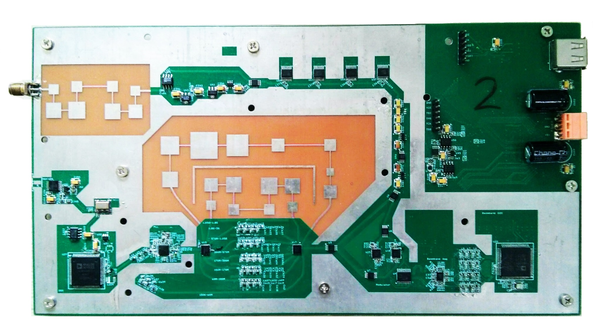
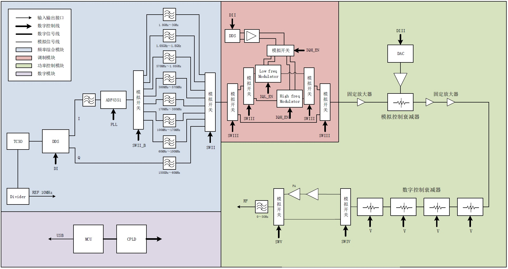

  

    

      
Can a capable RF signal generator be built entirely from off-the-shelf components? This team project set out to find out, and to measure how well such a design performs.

      
The result covers <strong>150 kHz to 3 GHz</strong> in 0.1-Hz steps, with output power adjustable from <strong>−130 dBm to +20 dBm</strong> in 0.1-dB steps. It is a complete instrument: RF hardware, a microcontroller and a CPLD to run it, and a control program on a PC.

      
Team projectHardware and software

    

    <dl class="rp-facts">
      
<dt>Frequency range</dt><dd>150 kHz – 3 GHz, 0.1-Hz steps</dd>

      
<dt>Output power</dt><dd>−130 to +20 dBm, 0.1-dB steps</dd>

      
<dt>Phase noise at 2.2 GHz</dt><dd>−84 dBc/Hz at 1 kHz offset −93 dBc/Hz at 10 kHz offset</dd>

    </dl>
  

  <figure class="rp-monitor">
    
    <figcaption><b>Fig. 1</b>The prototype</figcaption>
  </figure>
  

    
<b>3 GHz</b>top frequency, from 150 kHz

    
<b>0.1 Hz</b>frequency step

    
<b>150 dB</b>output power range

    
<b>−93</b>dBc/Hz at 10 kHz offset, 2.2 GHz

  

  <section>
    <h2>Hardware</h2>
    
Synthesizer, filters, modulation, power control

    <figure class="rp-fig"><figcaption><b>Fig. 2</b>System block diagram</figcaption></figure>
    

      
The signal chain (Fig. 2) starts with a frequency synthesizer, followed by a filter array, a modulation circuit, and a power controller, all managed by a microcontroller. The microstrip filters were designed in Agilent ADS, and the schematics and PCB layout in Cadence Capture and OrCAD.

    

  </section>
  <section>
    <h2>Software</h2>
    
Three layers of control

    

      
<small>Microcontroller</small><strong>Atmel ATmega88PA</strong>Written in C with AVR Studio.

      
<small>CPLD</small><strong>Xilinx XC95144XL</strong>Written in Verilog with the Xilinx ISE Design Suite.

      
<small>PC</small><strong>Control interface</strong>Written in C# with Microsoft Visual Studio.

    

  </section>
  

    Team project
    <a href="/research-projects/">All research projects</a> · <a href="/publications/">Publications</a>
  

